# AgentAgenda: Agenda con chat y LLM para Android

Proyecto monorepo: aplicación móvil en **Flutter para Android**, backend autónomo empaquetado en **Docker**, base de datos **SQLite** y motor de inferencia **LLM autohosteado** en servidor personal.

## 1. Organización del repositorio (Monorepo)

Para maximizar la velocidad de desarrollo y simplificar el mantenimiento de este proyecto personal, el repositorio unifica la aplicación móvil y el backend en un único monorepo:

```mermaid
flowchart TD
    subgraph Repo["AgentAgenda (Monorepo)"]
        subgraph App["apps/mobile (Flutter Android)"]
            F1["lib/features/agenda (Hoy, Semana, Tareas)"]
            F2["lib/features/chat (Chat y Aprobación de Propuestas)"]
            F3["lib/core/storage (Caché local SQLite y Sync)"]
        end
        subgraph Backend["services/backend (FastAPI / Docker)"]
            B1["app/api (Rutas REST y streaming de chat)"]
            B2["app/services/llm.py (Conector inferencia local)"]
            B3["app/services/scheduler.py (Recordatorios y Outbox)"]
            B4["app/db (SQLite autoridad de datos)"]
            B5["Dockerfile"]
        end
        subgraph Deploy["deploy/ (Infraestructura servidor)"]
            D1["docker-compose.yml (Backend + llama.cpp / Ollama)"]
            D2["Tunnel / Dominio público (Cloudflare / ici-labs.com)"]
        end
    end

    App -->|HTTPS / Dominio personal| Backend
    Backend -->|Red interna Docker / IPC| Deploy
```



### Estructura de carpetas propuesta

```text
AgentAgenda/
├── apps/
│   └── mobile/                # Aplicación Flutter para Android
│       ├── lib/
│       │   ├── features/
│       │   │   ├── agenda/    # Vistas de hoy, semana, lista de tareas
│       │   │   ├── chat/      # Interfaz de chat y tarjetas de propuesta
│       │   │   └── settings/  # Configuración del servidor y credenciales
│       │   └── core/          # SQLite local, cliente HTTP, sync offline
│       └── pubspec.yaml
├── services/
│   └── backend/               # Servicio API y orquestador
│       ├── app/
│       │   ├── api/           # Endpoints: auth, agenda, tasks, chat, sync
│       │   ├── core/          # Configuración, seguridad y tokens
│       │   ├── db/            # SQLite, modelos y migraciones
│       │   └── services/      # Cliente LLM, planificador de recordatorios
│       ├── Dockerfile
│       └── pyproject.toml
├── deploy/                    # Configuración de despliegue en servidor
│   ├── docker-compose.yml     # Orquestación de backend + llama-server
│   └── env.example            # Variables de entorno
├── PLAN.md                    # Plan y especificación técnica
└── README.md
```

## 2. Decisión principal y componentes

Construir la app móvil en **Flutter**, el backend en **Python/FastAPI empaquetado en Docker**, con base de datos **SQLite en el servidor** (autoridad) y **SQLite en el móvil** (operación offline). La inferencia LLM se ejecuta autohosteada en el servidor personal conectado mediante dominio público seguro (Cloudflare / `ici-labs.com`).

La base de datos del servidor es la autoridad sobre tareas, eventos confirmados y recordatorios. El modelo ayuda a conversar, consultar y proponer cambios estructurados; toda modificación pasa por una vista previa y requiere confirmación explícita del usuario en la interfaz antes de impactar los datos reales.

| Componente | Decisión técnica | Justificación |
| --- | --- | --- |
| **Móvil** | Flutter (Android) | Desarrollo ágil de UI reactiva (Hoy, Semana, Tareas, Chat interactivo). |
| **Backend** | Python (FastAPI) en Docker | Máxima velocidad de desarrollo ("salir rápido"), excelente soporte nativo para tool-calling, validación Pydantic y streaming SSE. |
| **Base del servidor** | SQLite en volumen Docker | Cero administración, backups en un solo archivo `.db`, rendimiento sobrado para un usuario. |
| **Base del teléfono** | SQLite local (sqflite / Drift) | Consulta y alarmas locales sin conexión; sincronización incremental por API. |
| **Inferencia LLM** | `llama-server` / `Ollama` en Docker con GPU | Autohosteado en el servidor personal aprovechando aceleración CUDA. |
| **Red y Exposición** | Dominio público personal (`ici-labs.com` / Cloudflare Tunnel) | Acceso seguro HTTPS desde el móvil sin exponer puertos locales directamente. |
| **Recordatorios** | Alarmas locales en Android + planificador backend | El móvil garantiza alarmas locales inmediatas; el backend orquesta reintentos y sync. |

## 3. Comportamiento de producto

La aplicación debe permitir consultar el día o la semana, mantener tareas y crear eventos mediante formularios. El chat responde preguntas sobre los registros autorizados, detecta conflictos y presenta propuestas de organización. Cada elemento debe indicar si es **confirmado**, **provisional** o **pendiente de sincronización**.

Flujo de una propuesta del chat:

1. Interpretar la petición con el contexto mínimo necesario.
2. Consultar tareas o eventos por herramientas de lectura con alcance limitado.
3. Construir una propuesta tipada; el backend valida fechas, referencias, permisos, solapamientos y versiones.
4. Mostrar cambios concretos: título, fecha, hora, zona, duración, recordatorios y posibles conflictos; si falta información decisiva, solicitarla antes de confirmar.
5. El usuario confirma o descarta en la interfaz. Una frase del modelo como «confirmado» nunca constituye autorización.
6. Al confirmar, comprobar otra vez las versiones y ejecutar una transacción idempotente. Después se actualizan los recordatorios.

Un horario provisional importado sirve de contexto: **no se transforma automáticamente en eventos confirmados ni en alertas**. La confirmación de un evento tampoco activa por sí sola un recordatorio no mostrado; la configuración de avisos forma parte de la vista previa o de una preferencia explícita del usuario.

### Fechas, zonas y recurrencias

- Zona inicial: **`America/Mexico_City`**, almacenada como identificador IANA, no como un desfase fijo.
- Instantes de eventos: UTC en la base, junto con la zona de interpretación y presentación. Las recurrencias conservan su regla de hora local y zona.
- Un vencimiento que solo tiene día conserva un campo de fecha; no inventar una hora ni convertirlo silenciosamente en medianoche.
- Distinguir «martes a las 9» de «antes del martes». Resolver ambigüedades de fecha o zona antes de crear una propuesta confirmable.
- En viajes, preguntar si la agenda mantiene la zona original o adopta la zona del dispositivo. No cambiar compromisos al detectar otra zona sin una política visible.
- Para empezar, admitir eventos únicos y recurrencias semanales simples; ampliar reglas y excepciones después de probar su edición y cancelación.

## 4. Recordatorios y operación sin conexión

El planificador del backend consulta recordatorios persistidos, reclama trabajo de forma transaccional y registra intentos, caducidad y resultado. Una tabla de salida pendiente —outbox— se escribe en la misma transacción que el cambio del evento. Tras un reinicio, el trabajador retoma lo pendiente. No usar una conversación, un temporizador en memoria o una tarea de petición HTTP como única fuente de los avisos.

En el teléfono, programar un horizonte acotado de recordatorios de eventos confirmados y renovar ese horizonte al sincronizar. Las tareas en caché siguen visibles sin red. Los cambios manuales sin conexión quedan marcados como pendientes; una creación local confirmada por el usuario puede tener aviso local, pero se informa que aún no está respaldada en el servidor. Si al reconectar hay conflicto, resolverlo con una nueva vista previa; no aplicar silenciosamente «gana la última escritura».

**FCM no es un reloj exacto ni una confirmación de entrega.** La prioridad normal puede demorarse; la alta intenta entrega inmediata y se reserva para contenido visible y sensible al tiempo. La aceptación del mensaje por FCM no prueba que el dispositivo lo haya mostrado. Configurar caducidad para evitar avisos tardíos inútiles. [Prioridad de FCM](https://firebase.google.com/docs/cloud-messaging/customize-messages/setting-message-priority) y [vida útil de mensajes](https://firebase.google.com/docs/cloud-messaging/customize-messages/setting-message-lifespan).

Política propuesta para combinar canales:

- FCM normal avisa que hay una nueva versión y la app obtiene los datos mediante la API autenticada.
- El aviso local es el canal principal cuando el dispositivo reconoce que ya programó ese recordatorio. El push visible es una alternativa cuando no existe esa confirmación, sujeta a las limitaciones de entrega.
- Cada ocurrencia tiene `reminder_id`, `event_version` y un identificador estable de notificación. La app descarta versiones antiguas y evita volver a presentar avisos ya procesados.
- Elegir un solo canal de presentación por recordatorio y dispositivo cuando sea posible. La deduplicación debe ocurrir también en el mecanismo de presentación; no basta con deduplicar una fila del servidor si Android muestra automáticamente otro mensaje.
- Actualizar o cancelar un evento invalida sus avisos anteriores y programa los nuevos. Un teléfono sin conexión puede conservar temporalmente una alarma de un evento cancelado en otro dispositivo; mostrar última sincronización y reconciliar al recuperar red.
- Persistir estados como pendiente, aceptado por proveedor, recibido por app y abierto por usuario sin confundirlos. No prometer entrega exactamente una vez.
- El payload de FCM contendrá identificadores opacos, versión y texto genérico. Los detalles se obtienen de la caché o la API; no enviar conversaciones ni contexto personal completo a FCM.

### Permisos y límites de Android

Solicitar el permiso de notificaciones cuando el usuario active recordatorios. Android 13 o posterior lo requiere; si se deniega, mantener la agenda utilizable y mostrar el estado. La documentación de Flutter/FCM advierte que, después de forzar la detención de la app desde ajustes de Android, debe abrirse de nuevo para reanudar mensajes. [Recepción de mensajes en Flutter](https://firebase.google.com/docs/cloud-messaging/flutter/receive-messages).

Para avisos orientativos, usar programación inexacta y explicar su margen. Si el usuario solicita una alarma de calendario que debe sonar a una hora precisa, evaluar la API de alarmas exactas y el permiso correspondiente. Android permite este uso cuando la función central exige precisión; en Android 14 el acceso `SCHEDULE_EXACT_ALARM` no viene concedido para muchas instalaciones nuevas. Comprobar el acceso antes de programar, ofrecer el flujo del sistema cuando corresponda y degradar con un estado visible si falta. No añadir `USE_EXACT_ALARM` indiscriminadamente. [Alarmas de Android](https://developer.android.com/develop/background-work/services/alarms) y [cambios de alarmas exactas en Android 14](https://developer.android.com/about/versions/14/changes/schedule-exact-alarms).

La fase de implementación elegirá y revisará un complemento Flutter de notificaciones locales mantenido, verificando sus permisos y comportamiento nativo. Probar también reinicio, cambio de zona, actualización, ahorro de batería y revocación de permisos. Mantener un diagnóstico sencillo: permiso, sincronización, avisos programados y disponibilidad del servidor.

## 5. Integración con PersonalLLM

### Frontera de acceso

No sincronizar la carpeta completa a Git, Drive, el teléfono ni la máquina del modelo. No montar sus directorios en el backend o en llama-server. El único puente será una **exportación explícita, mínima y revisada**. Este plan se redactó con las instrucciones proporcionadas, sin leer archivos de PersonalLLM.

- `SAFE`: únicamente campos aprobados y necesarios para organizar la semana. Que una información sea SAFE no significa que deba incorporarse por completo.
- `OPT_IN`: excluido del MVP; solo podría añadirse en otra exportación con autorización actual y específica para esa tarea. Los resúmenes conservan la sensibilidad de sus fuentes.
- `NEVER_UPLOAD`: excluido siempre; no incluir identificaciones, firmas, claves, códigos, cuentas u otros datos equivalentes, ni documentos oficiales completos.
- Nunca acceder a `98_BOVEDA_PRIVADA_NO_COMPARTIR`. No leer INBOX, finanzas ni otras fuentes privadas para alimentar esta aplicación.

### Snapshot semanal

Nombre lógico: `weekly_context.json`. Contenido permitido: objetivos elegidos, obligaciones y prioridades relevantes, plazos confirmados y referencias a un plan provisional. Cada elemento llevará categoría de certeza —hecho confirmado, estimación, intención o inferencia—, fecha de actualización y referencia de origen no sensible. Las tareas operativas y el calendario permanecen en la base de datos; el snapshot aporta contexto y no duplica manualmente todas las tablas.

Esquema orientativo, con campos vacíos y sin información personal:

```json
{
  "schema_version": 1,
  "snapshot_id": "identificador_opaco",
  "revision": 1,
  "created_at": "fecha_hora_ISO8601_con_zona",
  "valid_until": "fecha_hora_ISO8601_con_zona",
  "timezone": "America/Mexico_City",
  "sensitivity": "SAFE",
  "approval": {"reviewed_by_user": true, "approved_at": "fecha_hora_ISO8601_con_zona"},
  "payload": {
    "goals": [],
    "obligations": [],
    "priorities": [],
    "deadlines": [],
    "provisional_plan": []
  },
  "content_hash": {"algorithm": "SHA-256", "value": "digest_del_contenido_canonizado"}
}
```

El importador valida esquema, tamaños, sensibilidad declarada, revisión y caducidad. La declaración SAFE requiere revisión humana: un detector automático no puede demostrarla. Calcular el hash sobre una serialización JSON canónica acordada del documento, excluyendo únicamente el propio campo `content_hash`; comprobarlo al importar. El hash detecta cambios de contenido, pero no acredita identidad: la autenticidad depende del canal autenticado y de quién aprueba la importación.

Propuesta de operación: un snapshot semanal con caducidad explícita al cierre de la semana o un plazo menor elegido al aprobarlo. Conservar versiones inmutables bajo una retención acotada y visible; señalar reemplazos y revocaciones. Al caducar, el chat informa que su contexto está vencido y pide actualizarlo antes de usar prioridades antiguas para nuevas propuestas. **La caducidad del contexto no borra tareas, compromisos ni avisos ya confirmados.** Un snapshot nuevo tampoco sobrescribe cambios posteriores de la base.

### Transporte y revisión con un modelo grande

Elegir para el MVP: exportación manual en una ubicación de datos fuera del checkout, revisión de su contenido, importación autenticada por HTTPS al backend y lectura selectiva de la versión aprobada desde Android. La interfaz de importación muestra un resumen y solicita confirmar ese paquete concreto. No implementar un observador de toda la carpeta.

Un webhook futuro puede anunciar un identificador de versión, sin incluir contenido personal, para que el backend realice una lectura autenticada. Drive puede servir como copia versionada opcional de paquetes aprobados, preferentemente cifrados cuando corresponda; no como base de datos ni como mecanismo de sincronización de archivos SQLite activos. Su uso requerirá elegir expresamente esa copia y sus permisos.

La revisión semanal con un modelo grande será **manual**: exportar solo el snapshot vigente, resultados necesarios y propuestas pendientes; el usuario revisa qué se comparte y con qué proveedor. El modelo grande devuelve propuestas. El usuario decide qué aplicar a la agenda y qué actualizar por separado en los documentos canónicos. Después se genera un nuevo snapshot aprobado. El modelo de 30B tampoco edita canónicos: sus sugerencias de cambio quedan pendientes. Este flujo no crea una automatización semanal.

## 6. Datos y contratos orientativos

Todas las entidades tienen un identificador opaco, pertenencia al usuario y versión. Usar referencias explícitas entre origen, propuesta y registros resultantes. Los campos siguientes son una guía de diseño, no una migración implementada.

| Entidad | Campos centrales |
| --- | --- |
| `Task` | `id`, `title`, `status`, `priority`, `due_date` o `due_at`, `timezone`, `source_ref`, `version`, `updated_at` |
| `CalendarEvent` | `id`, `title`, `start_at`, `end_at`, `timezone`, regla de recurrencia opcional, estado provisional/confirmado/cancelado, `source_ref`, `version` |
| `Reminder` | `id`, `event_id`, `event_version`, ocurrencia, `fire_at`, canal por dispositivo, `expires_at`, estado e intentos |
| `Proposal` | `id`, operaciones permitidas, versiones esperadas, referencias consultadas, explicación breve, `expires_at`, estado pendiente/confirmada/descartada/caducada |
| `ContextSnapshot` | identificador, esquema, revisión, aprobación, sensibilidad, hash, vigencia y ubicación privada del contenido |
| `Device` | identificador, credencial revocable, token FCM protegido, última sincronización y capacidades/permisos informados |
| `Outbox` | identificador idempotente, operación pendiente, referencia, estado, próximo intento y caducidad |
| `AuditEvent` | actor usuario/sistema/modelo, acción, entidad, versiones, marca de tiempo y resultado; sin copiar prompts o secretos |

Retención del chat: empezar con sesiones acotadas y una opción visible para conservar o eliminar historial. El calendario y las tareas no dependerán de reconstruir conversaciones antiguas. Un resumen del chat no se convierte automáticamente en hecho confirmado.

| Ruta orientativa | Función y control principal |
| --- | --- |
| `POST /v1/auth/pair` y `/v1/auth/refresh` | Vincular dispositivo con desafío breve de un solo uso y renovar credenciales; limitar intentos. |
| `GET /v1/agenda` | Consultar intervalo acotado y zona; devolver eventos y sus versiones. |
| `GET /v1/tasks` | Consultar tareas con filtros y paginación. |
| `GET /v1/sync?cursor=...` | Obtener cambios selectivos, versiones y cancelaciones desde un cursor. |
| `POST /v1/proposals` | Crear una propuesta validada desde chat o formulario; no aplica cambios al calendario. |
| `POST /v1/proposals/{id}/confirm` | Acción de interfaz autenticada: validar caducidad, versiones e idempotencia; aplicar y registrar atómicamente. |
| `POST /v1/proposals/{id}/reject` | Descartar propuesta, sin mutar tareas o eventos. |
| `POST /v1/chat` | Chat con streaming opcional, límites de entrada/salida, herramientas permitidas y tiempo máximo. |
| `POST /v1/context/import` y `GET /v1/context/manifest` | Importar un paquete aprobado y consultar su versión/vigencia; sin exploración de archivos. |
| `POST /v1/devices/{id}/reminders/ack` | Registrar recepción o programación local, sin confundirla con visualización. |
| `GET /v1/status` | Estado mínimo del backend y disponibilidad de inferencia, sin exponer configuración interna. |

Los endpoints de confirmación no estarán incluidos entre las herramientas del modelo. Si una propuesta afecta varias entidades, confirmar todas en una sola transacción o no aplicar ninguna. Ante una revisión desactualizada, devolver conflicto y producir una vista previa nueva. Una repetición por red no puede crear dos eventos.

## 7. Facultades del LLM y controles

| Permitido dentro del alcance del usuario | Fuera de sus facultades |
| --- | --- |
| Consultar agenda y tareas mediante filtros limitados | Abrir archivos, carpetas, terminal, URLs arbitrarias o una base de datos mediante SQL libre |
| Resumir el contexto SAFE vigente y señalar su antigüedad | Acceder a secretos, identificaciones, bóveda, INBOX, finanzas o paquetes OPT_IN no autorizados |
| Proponer un cambio tipado y explicar conflictos | Confirmar sus propias propuestas o modificar directamente calendario y canónicos |
| Solicitar aclaración sobre fechas o prioridades ambiguas | Inventar fechas o tratar planes provisionales como obligaciones confirmadas |
| Redactar una propuesta de revisión semanal | Enviar mensajes, pagos, solicitudes o acciones externas; activar recordatorios por su cuenta |

Herramientas iniciales: `list_events`, `list_tasks`, `get_context_manifest` y `propose_change`. El backend limita campos, intervalos, cantidad de resultados y número de llamadas por turno. La llamada a una herramienta devuelve datos o una propuesta pendiente; no otorga nuevas capacidades. Contenido de tareas, documentos o respuestas de herramientas se trata como datos no confiables, nunca como instrucciones que alteren permisos.

llama.cpp documenta llamadas a funciones compatibles con el formato OpenAI usando `--jinja` y una plantilla adecuada. El soporte genérico puede gastar más tokens que un formato nativo; la calidad debe probarse con el modelo concreto. Empezar sin llamadas paralelas y con pocas herramientas. [Documentación oficial de function calling](https://github.com/ggml-org/llama.cpp/blob/master/docs/function-calling.md).

Una salida ajustada a JSON Schema ayuda con la forma; el backend sigue comprobando el significado, las fechas y la autorización. Deshabilitar las capacidades integradas de ejecución o acceso a archivos de cualquier servidor/agente auxiliar. En llama-server no habilitar `--agent`, herramientas de filesystem, MCP ni directorios permitidos para este MVP.

## 8. Privacidad, autenticación y repositorio

- La VPN o el túnel protege el acceso de red, pero no sustituye la autenticación de la aplicación. Usar TLS, credenciales revocables por dispositivo y autorización sobre cada entidad.
- Para un uso personal, proponer emparejamiento iniciado por el usuario mediante un código o desafío temporal de un solo uso, con caducidad y límites de intentos. Revisar su implementación antes de exponerla fuera de una red privada; autenticación mediante un proveedor de identidad es una alternativa futura.
- Guardar credenciales del teléfono usando almacenamiento seguro apoyado por Android Keystore. Guardar claves del backend y credenciales de FCM fuera del repositorio. La aplicación no contiene la clave administrativa del modelo ni las credenciales de servicio de Firebase.
- Mantener llama-server accesible solo desde el backend por red privada y con una credencial del servidor cuando se use su soporte de API key. No exponer interfaces de administración, métricas o configuración a internet.
- Limitar tamaños, duración y frecuencia de peticiones. No registrar prompts, tokens, claves ni snapshots completos en logs de producción; registrar identificadores y errores minimizados.
- Mantener datos de ejecución, exportaciones, bases, chats, backups y modelos fuera del checkout. El repositorio almacena código, esquemas, documentación genérica y ejemplos ficticios. Preferir repositorio privado, pero incluso uno privado queda fuera del destino permitido para la carpeta completa de PersonalLLM.
- Antes de cualquier publicación futura, revisar la visibilidad del remoto y el contenido exacto de los archivos. No hacer push como parte de este plan. La privacidad del repositorio y un archivo de exclusiones no eliminan datos ya incorporados a su historial.
- Aplicar permisos mínimos del sistema y copias recuperables con cifrado según el destino. Respaldar SQLite con un mecanismo consistente, no copiar indiscriminadamente el archivo activo. Probar restauración antes de confiar en una copia.
- Eliminar o revocar un snapshot debe invalidar su uso posterior y definir cómo expiran las copias y backups. No enviar datos automáticamente a otro proveedor cuando falle el modelo local.

## 9. Contexto, capacidad y saturación de llama.cpp

La documentación del servidor incluye chat en `/v1/chat/completions`, tamaño de contexto, slots paralelos, autenticación por API key y formatos estructurados. `/health` puede indicar carga en curso mediante HTTP 503 y no exige API key en la implementación documentada: proteger también esa superficie mediante la red o el proxy. Las opciones concretas y sus valores por defecto deben contrastarse con la versión instalada. [README oficial de llama-server](https://github.com/ggml-org/llama.cpp/blob/master/tools/server/README.md).

El presupuesto de entrada suma instrucciones, herramientas, snapshot, registros recuperados e historial; reservar además espacio para la respuesta. Recuperar solo el intervalo de agenda y las tareas relevantes. Si no cabe, reducir el alcance explícitamente o pedir precisar la consulta; no perder silenciosamente obligaciones. La memoria persistente será la base y el snapshot, no el contexto o la caché de inferencia.

Para las primeras pruebas, fijar un solo trabajo de inferencia simultáneo y una cola pequeña con longitud máxima. El backend tendrá tiempo límite, cancelación cuando se desconecte el cliente y rechazo controlado con `429`/`Retry-After` cuando su propia cola se llene. Estos códigos son una decisión de la API propuesta, no una suposición sobre todas las respuestas de llama-server. Los recordatorios usan un trabajador separado y siguen avanzando aunque la inferencia se sature.

No inferir RAM, VRAM, latencia, contexto útil o fiabilidad a partir de «30B». Dependen del modelo, cuantización, longitud de entrada/salida, KV cache, número de secuencias, reparto CPU/GPU y hardware real. Aumentar concurrencia o contexto solo después de medir memoria y tiempos bajo carga.

## 10. MVP por fases y criterios de salida

| Fase | Resultado concreto | Criterio para avanzar |
| --- | --- | --- |
| 0. Comprobación en la otra máquina | Ficha del modelo, hardware, versión y pruebas sintéticas de inferencia | Arranque y chat correctos; latencia y memoria medidas; no se comparte contexto personal. |
| 1. Agenda determinista | Flutter con día/semana/tareas, formulario y almacenamiento local | Crear, editar y cancelar mediante confirmación; recuperar datos después de cerrar y abrir. |
| 2. Backend y sincronización | Auth, SQLite, API, versiones y cola offline | Sin duplicados por reintento; conflictos visibles; restauración de copia demostrada. |
| 3. Contexto y chat | Importación SAFE, lectura limitada y propuestas | Snapshot caducado señalado; ninguna propuesta muta la agenda sin confirmación. |
| 4. Recordatorios | Planificador durable, programación local y FCM | Funcionan sin LLM; se cancelan o actualizan al sincronizar; permisos y fallos visibles. |
| 5. Uso piloto | Revisión semanal manual, diagnósticos y retención | Una semana de uso supervisado con correcciones antes de ampliar capacidades. |

El primer MVP no necesita búsqueda vectorial, agentes autónomos, sincronización de toda la carpeta, varias cuentas, automatizaciones semanales ni publicación en tienda. Posponer PostgreSQL y el despliegue distribuido hasta que una necesidad medida lo justifique.

Pruebas de aceptación prioritarias:

1. Petición ambigua, fecha inválida o salida del modelo mal formada: no cambia la agenda.
2. Una propuesta confirmada dos veces, una respuesta de red perdida o un reintento: un solo cambio aplicado.
3. Dos ediciones sobre versiones distintas: conflicto visible y nueva confirmación, sin pérdida silenciosa.
4. Snapshot vencido, revocado o con hash incorrecto: se señala/rechaza según el caso; los compromisos confirmados permanecen.
5. Horario provisional importado: ningún aviso aparece hasta confirmar evento y recordatorio.
6. Modelo apagado o saturado: agenda y planificador siguen operativos; el chat informa indisponibilidad.
7. Notificaciones denegadas, acceso a alarma exacta denegado, reinicio, fuerza de detención y ahorro de batería: estado coherente y límites visibles.
8. Evento cambiado o cancelado con un teléfono offline: reconciliación de versiones, prueba de avisos viejos y deduplicación entre canales.
9. Cambio de zona, vencimiento sin hora y recurrencia semanal: conservar la intención temporal y no desplazar días por conversión UTC.
10. Texto malicioso dentro de una tarea o snapshot: no obtiene herramientas nuevas, secretos ni capacidad de confirmación.
11. Exportación y restauración: recuperar tareas y versiones sin duplicar avisos pendientes.

## 11. Lista para mañana: validar la otra máquina

Esta lista describe acciones futuras. Ninguna se ejecutó al redactar el plan.

- [ ] Identificar el modelo exacto, familia, archivo GGUF, cuantización, checksum, licencia y ficha oficial; confirmar que es una variante adecuada para instrucciones/chat.
- [ ] Registrar sistema operativo, CPU, RAM, GPU y VRAM reales, almacenamiento disponible y backend de aceleración compatible.
- [ ] Fijar versión o commit de llama.cpp y consultar la ayuda de ese `llama-server` antes de adoptar flags de la documentación actual.
- [ ] Confirmar plantilla de chat y compatibilidad con herramientas; activar `--jinja` solo con configuración apropiada. Empezar con una conversación sintética corta.
- [ ] Elegir un contexto inicial moderado y una secuencia simultánea; registrar memoria máxima, tiempo de primer token y tiempo total. Repetir con un contexto representativo, todavía ficticio.
- [ ] Registrar dirección privada, puerto, nombre/alias del modelo y URL base; verificar el endpoint de chat, el comportamiento de carga y la autenticación sin abrir el servicio públicamente.
- [ ] Separar credenciales del dispositivo, backend, inferencia y FCM; comprobar que ninguna se incorpora a un archivo versionado.
- [ ] Probar una consulta de agenda sintética, una fecha ambigua y una propuesta JSON. Medir errores de fechas y argumentos; no evaluar solo que el servidor responda.
- [ ] Medir saturación, cancelación y recuperación con la cola limitada. Confirmar que fallar o repetir una inferencia no puede aplicar operaciones.
- [ ] Decidir dónde vivirán backend, SQLite y planificador según el horario real de encendido de los equipos; documentar qué funciona cuando cada pieza está apagada.
- [ ] Elegir VPN o túnel con autenticación y HTTPS, y comprobar conexión desde el teléfono cuando se implemente. No se necesita comprar un dominio para esta validación.
- [ ] Tras aprobar los resultados técnicos, definir la primera exportación SAFE y su caducidad. No usar la carpeta PersonalLLM como conjunto de prueba.

## 12. Componentes y costos a comprobar

| Elemento | Qué hay que evaluar antes de contratar o instalar |
| --- | --- |
| Otra máquina y modelo | Disponibilidad, consumo eléctrico, almacenamiento, descarga y licencia del modelo; tiempo de mantenimiento. |
| Backend siempre encendido, si hace falta | Equipo existente o alojamiento, memoria y disco para datos, copias y transferencia; evita exigir que la GPU permanezca encendida solo para avisos. |
| VPN o túnel | Límites, dispositivos, seguridad y condiciones actuales del proveedor elegido. |
| FCM/Firebase | Configuración del proyecto, credenciales, compatibilidad del dispositivo Android y condiciones vigentes de los servicios que realmente se activen. |
| Backups o Drive opcional | Capacidad, cifrado, recuperación, retención y permisos; solo paquetes explícitamente aprobados. |
| Distribución Android | Instalación de prueba al principio; revisar requisitos y costos de tienda únicamente si se decide publicar. |
| Dominio | Opcional; disponibilidad, renovación y proveedor se evalúan aparte del funcionamiento de la agenda. |

No se estiman precios ni se presupone que el hardware ya disponible sostendrá un 30B con una configuración concreta. La primera decisión posterior a este documento será validar el modelo y el equipo con datos sintéticos; después, construir la agenda determinista y añadir el chat sobre ella.
