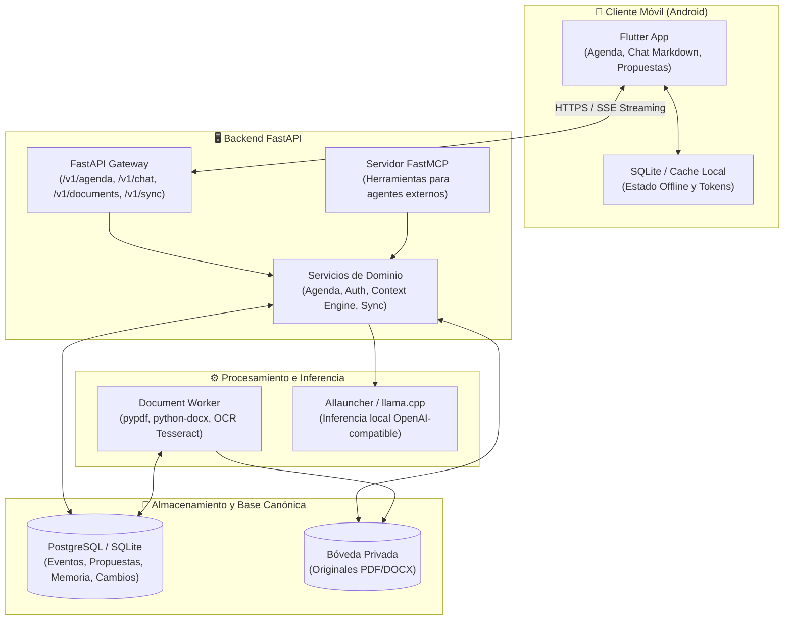

# AgentAgenda 🗓️🤖

**Asistente personal de organización, seguimiento y archivo documental con inferencia local, memoria continua y sincronización bidireccional.**

AgentAgenda conecta tus tareas y compromisos cotidianos con las personas, fechas y documentos que necesitas para cumplirlos. A través de una conversación fluida y natural, accesible desde tu dispositivo móvil (Android/Flutter) o mediante agentes externos conectados (FastMCP), AgentAgenda gestiona tu agenda diaria, preserva tus documentos privados y mantiene una memoria contextual persistente sin comprometer tu privacidad.

---

## 🌟 Características Principales

### 📅 Agenda Inteligente y Vistas Temporales
- **Vistas Día, Semana y Mes:** Navegación intuitiva entre periodos con sincronización de estado entre vistas.
- **Carrusel de Actividad Actual:** Foco dinámico en la actividad en curso según la hora actual, con acceso directo a actividades previas y siguientes.
- **Detección de Huecos y Check-ins de Actividad:** Durante los periodos libres de tu jornada, la app te invita interactivamente a registrar qué estás haciendo ("*¿Qué estás haciendo ahora?*") para alimentar tu contexto diario sin notificaciones invasivas.
- **Normalización Temporal UTC / IANA:** Almacenamiento canónico en UTC con preservación de la zona horaria (`America/Mexico_City`), soporte completo para eventos que cruzan medianoche y renderizado automático en la hora local del dispositivo.

### 💬 Chat Continuo, Streaming y Markdown Enriquecido
- **Streaming en Tiempo Real (SSE):** Generación fluida token por token conectada a motores locales (llama.cpp / AIlauncher).
- **Formato Markdown Completo:** Renderizado nativo de texto enriquecido mediante `flutter_markdown_plus`, incluyendo títulos, negritas, cursivas, listas ordenadas y desordenadas, bloques de código estilizados con tipografía monospace y citas en bloque.
- **Tarjetas de Propuesta de Agenda (*Agent Proposals*):** Cuando el asistente detecta intenciones de agendar o modificar actividades, emite una propuesta estructurada que se presenta en una tarjeta visual interactiva para confirmar o descartar con un solo toque de forma atómica.

### 🧠 Memoria Estructurada y Motor de Contexto
- **Presupuesto Inteligente de Tokens:** El motor de contexto (`context_engine.py` / `prompt_builder.py`) gestiona un presupuesto estricto (`PROMPT_TOKEN_BUDGET`), ensamblando eventos relevantes, documentos citables y observaciones recientes sin saturar la ventana de inferencia del LLM.
- **Observaciones Fechadas y Memoria Temporal:** Las respuestas a los check-ins y hechos autobiográficos se almacenan con marcas temporales explícitas de validez, distinguiendo eventos pasados, hechos confirmados e intenciones.

### 📂 Bóveda Documental y Extracción Local con OCR
- **Almacén Privado de Documentos:** Ingesta de archivos originales (PDF, Word DOCX) fuera del repositorio, validando su integridad mediante sumas de verificación SHA-256.
- **Worker en Segundo Plano (`document-worker`):** Procesamiento asíncrono con extracción de texto y OCR local en español e inglés (vía Poppler / Tesseract), sin enviar tus archivos a servicios en la nube de terceros.
- **Citas Documentales en el Chat:** Respuestas fundamentadas con referencias exactas a las páginas o secciones de tus documentos, distinguiendo hechos verificados de inferencias.

### 🔄 Sincronización Canónica y Soporte Offline
- **Modelo Canónico:** Arquitectura orientada a eventos con cabeceras de sincronización (`SyncHead`), lotes de cambios (`ChangeBatch`) y marcadores de borrado (*tombstones*).
- **Resolución de Conflictos:** Sincronización idempotente con control de versiones que respeta ediciones manuales del usuario frente a precargas automáticas.

### 🔌 Servidor FastMCP Integrado
- **Integración con Agentes Externos:** Servidor FastMCP para conectar clientes externos autorizados (Codex, Claude, etc.) que permite consultar la agenda y documentos bajo permisos y alcances estrictamente delimitados.

---

## 🏗️ Arquitectura del Sistema



---

## 📁 Estructura del Repositorio

```text
AgentAgenda/
├── apps/
│   └── mobile/                       # Aplicación móvil Flutter (Android)
│       ├── lib/
│       │   ├── core/                 # Red, temas, conectores y utilidades
│       │   ├── features/
│       │   │   ├── agenda/           # Vistas Día/Semana/Mes, carrusel, cabecera
│       │   │   └── chat/             # Pantalla de chat, streaming, Markdown
│       │   └── main.dart             # Punto de entrada de Flutter
│       └── test/                     # Tests unitarios y de widgets
├── services/
│   └── backend/                      # Servicio FastAPI y workers
│       ├── alembic/                  # Migraciones canónicas de base de datos
│       ├── app/
│       │   ├── api/                  # Endpoints REST y streaming SSE
│       │   ├── core/                 # Seguridad, configuración y tokens
│       │   ├── db/                   # Sesiones, motor SQLAlchemy y seeds
│       │   ├── importing/            # Importadores de planes y documentos
│       │   ├── mcp/                  # Servidor FastMCP para agentes
│       │   ├── models/               # Modelos canónicos SQLAlchemy y Pydantic
│       │   ├── services/             # Lógica de agenda, chat, documentos y sync
│       │   └── worker/               # Worker de procesamiento documental y OCR
│       ├── tests/                    # Suite de más de 140 pruebas con Pytest
│       └── requirements.txt          # Dependencias Python
├── deploy/                           # Configuración Docker Compose y variables
├── docs/                             # Documentación técnica de arquitectura y diseño
│   ├── ARCHITECTURE_SPEC.md          # Especificación exhaustiva del sistema y memoria
│   ├── PERSONAL_IMPORT.md            # Guía de importación de boveda documental y OCR
│   ├── SCHEDULE.md                   # Guía de precarga de horarios y check-ins
│   ├── LIFELONG_CHAT_RESEARCH.md     # Marco de investigación de memoria continua
│   └── operations/                   # Bitácoras de despliegue y validación operativa
├── LICENSE                           # Licencia del proyecto
└── README.md                         # Este documento
```

---

## 🚀 Puesta en Marcha

### Prerrequisitos
- **Python 3.12+**
- **Flutter SDK 3.24+**
- **Docker y Docker Compose** (para despliegue de base de datos y workers)
- Motor de inferencia local compatible con la API de OpenAI (ej. `llama-server` o `AIlauncher`)

---

### 1. Configuración del Backend

1. Ingresa al directorio del backend y crea un entorno virtual:
   ```bash
   cd services/backend
   python3 -m venv .venv
   source .venv/bin/activate
   ```

2. Instala las dependencias del proyecto:
   ```bash
   pip install -r requirements.txt
   ```

3. Configura tus variables de entorno a partir de la plantilla:
   ```bash
   cp ../../deploy/.env.example .env
   # Edita .env con tu SECRET_KEY y credenciales correspondientes
   ```

4. Ejecuta las migraciones de base de datos:
   ```bash
   alembic upgrade head
   ```

5. Inicia el servidor de desarrollo:
   ```bash
   uvicorn app.main:app --host 0.0.0.0 --port 8000 --reload
   ```

---

### 2. Despliegue con Docker Compose

Para levantar el entorno completo con PostgreSQL, el backend y el worker de procesamiento documental:

```bash
cd deploy
docker compose up -d --build
```

Comprueba el estado del sistema en:
```bash
curl http://localhost:8001/v1/status
```

---

### 3. Ejecución de la App Móvil (Flutter)

1. Ingresa al directorio móvil:
   ```bash
   cd apps/mobile
   ```

2. Descarga los paquetes y dependencias:
   ```bash
   flutter pub get
   ```

3. Ejecuta la aplicación en tu dispositivo o emulador:
   ```bash
   flutter run --dart-define=BACKEND_URL=http://<IP_DE_TU_SERVIDOR>:8000
   ```

---

## 🧪 Pruebas y Validación

El proyecto cuenta con una cobertura exhaustiva de pruebas unitarias y de integración tanto en el backend como en la aplicación móvil:

- **Backend (Pytest):** Más de 140 pruebas que validan el flujo de chat durable, atomicidad de propuestas, importación de planes, resolución de conflictos de sincronización, autenticación y recuperación documental:
  ```bash
  cd services/backend
  .venv/bin/pytest
  ```

- **Móvil (Flutter Test):** Pruebas de modelos, conectores de red, renderizado de Markdown y componentes de interfaz:
  ```bash
  cd apps/mobile
  flutter test
  ```

---

## 🔒 Privacidad y Seguridad

- **Inferencia Local-First:** Tus consultas y datos no se envían a modelos comerciales en la nube; el procesamiento se realiza localmente.
- **Sin Secretos en Git:** Los tokens, contraseñas, certificados y archivos personales se mantienen estrictamente fuera del repositorio mediante `.gitignore` y políticas de importación seguras.
- **Tokens y Permisos Acotados (*Scopes*):** Cada cliente o dispositivo recibe credenciales específicas con permisos mínimos necesarios (`agenda:read`, `agenda:write`, `memory:read`, `documents:read`, etc.).

---

## 📚 Documentación Técnica Detallada

Para consultar los fundamentos teóricos, la especificación de arquitectura y guías de importación, revisa los documentos en la carpeta [`docs/`](docs/):

- [Especificación Completa de Arquitectura](docs/ARCHITECTURE_SPEC.md)
- [Guía de Importación Documental y Extracción OCR](docs/PERSONAL_IMPORT.md)
- [Gestión de Horarios y Registro de Actividades](docs/SCHEDULE.md)
- [Investigación sobre Memoria Continua y Agentes](docs/LIFELONG_CHAT_RESEARCH.md)

---

## 📄 Licencia

Este proyecto está distribuido bajo los términos de la Licencia MIT. Consulta el archivo [LICENSE](LICENSE) para más detalles.
