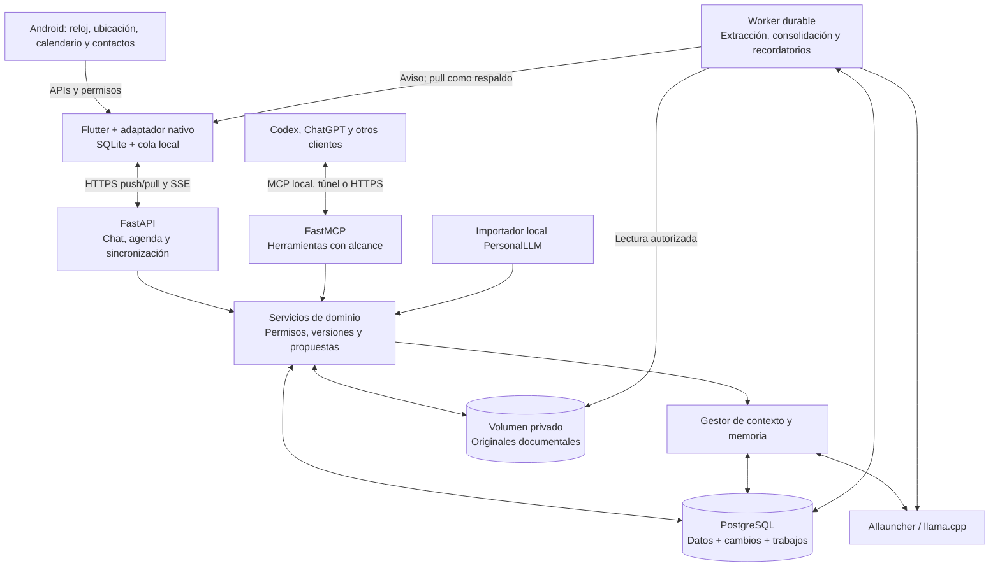

# AgentAgenda 🗓️🤖

**Asistente personal de organización y seguimiento, con memoria y archivo documental.** Conecta lo que tienes pendiente con las personas, fechas y documentos que necesitas para cumplirlo. Una conversación continua, accesible desde Android y agentes conectados, sirve de entrada a la agenda, la memoria y el archivo privado.

Flutter consulta datos autorizados del teléfono; FastAPI administra memoria, documentos, sincronización y acciones; AIlauncher/llama.cpp proporciona inferencia local.

**Especificación y plan únicos del proyecto.** Este README integra el plan anterior y las decisiones de memoria, móvil y acceso externo. Actualizado el **14 de septiembre de 2026**. La [investigación de memoria](docs/LIFELONG_CHAT_RESEARCH.md) conserva las fuentes y sus límites como referencia.

## 1. Estado actual y destino

La arquitectura objetivo requiere implementación. Esta actualización documental no activa sensores, migraciones ni conexiones externas.

| Área | Prototipo actual | Objetivo |
| --- | --- | --- |
| Android | Flutter, agenda/chat, propuestas y cliente HTTP/SSE | Caché persistente, cola offline, consulta del teléfono y sincronización incremental. |
| Backend | FastAPI con agenda, propuestas y streaming de texto | Servicios comunes para móvil, memoria, importador y agentes. |
| Persistencia | SQLite con `events`, `proposals` y una tabla `chat_messages` aún sin uso por la ruta de chat | PostgreSQL canónico en servidor; SQLite como caché móvil. |
| Conversación | Historial en memoria de Flutter; backend toma seis mensajes del cliente | Historial durable, recuperación por tokens, fuentes, correcciones y pendientes. |
| Archivo documental | Sin carga, clasificación ni devolución de archivos implementadas | Originales privados, catálogo consultable, descarga y documentos vinculados a compromisos. |
| Inferencia | `/v1/chat/completions`; propuestas extraídas del texto | Tool calling probado con el modelo local y resultados persistidos. |
| Teléfono | Fecha de consulta enviada al chat | Instante/IANA, ubicación puntual, calendarios elegidos y contactos seleccionados. |
| PersonalLLM y MCP | Sin importación ni conexión implementadas | Migración local por lotes y consultas selectivas desde Codex/ChatGPT. |

Los datos de demostración de `db/seed.py`, algunos marcados como completados, deben excluirse de memoria autobiográfica. La aceptación actual de propuestas modifica eventos por separado: necesita una transacción única antes de considerarse atómica.

## 2. Visión y decisiones

### Definición del producto

AgentAgenda es un **agente de organización personal**: captura información, la ordena, la relaciona con compromisos y ayuda a llegar preparado. La planeación es una de sus funciones; también conserva documentos, recupera contexto y da seguimiento a lo acordado.

Su utilidad se evaluará por encontrar el documento correcto, conservar cambios y cumplir recordatorios. El diseño distribuye el trabajo: el modelo interpreta lenguaje y propone relaciones; herramientas verificables guardan, buscan y devuelven archivos; la agenda y el scheduler ejecutan reglas persistidas. Las consultas complejas pueden aprovechar otro agente con acceso selectivo a esta misma memoria.

Ejemplo de experiencia objetivo, con datos ficticios:

1. **Guardar:** «Esta es mi constancia del curso». Se conserva el archivo original y aparece una ficha editable con título, tipo y fechas encontradas.
2. **Relacionar:** «La necesito para el trámite del domingo». Se busca el compromiso existente; si hay varios candidatos, se aclara cuál, y se vincula la constancia.
3. **Recuperar:** «Dame la constancia que necesito el domingo». La respuesta incluye el archivo descargable y el compromiso relacionado.
4. **Preparar:** con un aviso autorizado, «Tu cita es en una hora. Aquí tienes la constancia y el comprobante que anotaste; falta adjuntar la solicitud». La lista procede de requisitos registrados y muestra qué está pendiente.

### Decisiones

- **Continuidad:** una conversación principal visible, con episodios y contextos internos. Los pendientes sobreviven a medianoche, reinicios y cambios de modelo.
- **Interacción natural:** el chat consulta y propone; la interfaz ofrece agenda, revisión de propuestas, selección de datos del teléfono y controles de memoria.
- **Memoria propia:** conocimiento estructurado, documentos versionados y evidencia en PostgreSQL. La continuidad reside en los datos de la aplicación, no en los pesos ni en la caché del LLM.
- **Archivo útil:** preservar originales recuperables y relacionarlos con personas, tareas y compromisos. OCR, etiquetas y resúmenes son derivados revisables; no sustituyen el archivo.
- **Una base canónica:** PostgreSQL en servidor; SQLite móvil como réplica parcial y cola local. Markdown puede conservarse como contenido de documentos dentro de la base.
- **Inferencia local por defecto:** extracción, embeddings y respuesta con proveedores locales. Usar Codex o ChatGPT con esta memoria transmite los fragmentos devueltos a ese servicio; el almacenamiento propio no hace local esa inferencia.
- **Control persistente:** el usuario elige fuentes, campos y clientes autorizados. Una autorización vigente de lectura se reutiliza, sin pedir la misma confirmación en cada consulta.
- **Simplicidad:** backend modular, worker durable y PostgreSQL. Añadir vectores, relaciones complejas y aprendizaje de procedimientos cuando las pruebas justifiquen su coste.

## 3. Arquitectura objetivo



| Componente | Responsabilidad |
| --- | --- |
| AIlauncher | Cargar GGUF y servir inferencia compatible; agnóstico de agenda y datos personales. |
| AgentAgenda | Resolver contexto, recuperar fuentes y aplicar políticas y cambios mediante servicios de dominio. |
| Flutter | Interfaz, confirmaciones, datos autorizados del teléfono, caché, cola y alarmas locales. |
| Archivo privado | Originales fuera del repositorio; acceso mediante servicios autenticados, con metadatos y versiones en PostgreSQL. |
| Worker | Trabajo persistente y reintentos; los recordatorios no requieren GPU ni chat abierto. |
| MCP | Adaptador a esos mismos servicios; sin SQL libre ni exploración de carpetas por el modelo. |

### Tiempo e identidad

Separar `client_created_at`, `received_at`, zona IANA, vigencia y fecha del acontecimiento. El móvil aporta contexto local; el servidor registra recepción y orden operativo. Un mensaje offline conserva su instante original al sincronizarse.

Resolver «mañana» contra el mensaje original. Separar `view_date` de `now`: consultar otro día no cambia el presente. Zona inicial `America/Mexico_City`; instantes UTC e IANA almacenado aparte, porque `timestamptz` no conserva el nombre original de zona. Vencimientos sin hora son fechas; recurrencias conservan hora local, zona y excepciones. No desplazar citas al viajar sin la política elegida por el usuario. [PostgreSQL: tipos temporales](https://www.postgresql.org/docs/16/datatype-datetime.html).

## 4. Memoria estructurada

| Función | Contenido |
| --- | --- |
| Trabajo | Objetivo activo, referentes, pregunta pendiente y propuesta en curso. |
| Episódica | Qué ocurrió o se conversó, cuándo, con quién y según qué fuente. |
| Semántica | Hechos declarados, preferencias y restricciones revisables con vigencia. |
| Procedimental | Pasos útiles, condiciones de aplicación y resultados observados. |
| Prospectiva | Intenciones, compromisos y siguientes pasos vinculados a tareas y recordatorios. |

Es una organización funcional inspirada en ciencias cognitivas. La investigación distingue evidencia humana, experimentos animales y analogías de ingeniería. Lo social atraviesa todas las memorias: **quién dijo qué, de quién habla, en qué contexto y si hubo acuerdo**. Una emoción ocasional no se convierte automáticamente en personalidad.

### Escritura y consolidación

1. Persistir mensajes con rol, actor, identificador idempotente y estado de generación.
2. Aplicar al siguiente turno correcciones, preferencias explícitas y revocaciones, aunque la consolidación siga pendiente.
3. Extraer candidatos separando declaración, estimación, intención, percepción, inferencia y resultado observado; exigir enlaces a fuentes.
4. Conservar sujeto, contexto y vigencia. «Ahora cambió» introduce una versión; «me equivoqué» corrige la anterior. Fecha de conocimiento y fecha del cambio pueden diferir.
5. Consolidar por tema, tarea o presupuesto. El diario es una vista, no un reinicio; rehacer síntesis desde evidencia retenida y no sólo desde resúmenes previos.
6. Recordar acciones a partir de su resultado operativo. `propuesto`, `aceptado`, `realizado` y `cancelado` son distintos; registrar una cita no prueba asistencia.

El worker calcula fuera de la transacción, pero antes de publicar vuelve a comprobar, bajo el bloqueo canónico, IDs/versiones de fuentes, borrados y alcance vigente. Si cambiaron, descarta o recalcula. Publicar derivado, dependencias y resultado del job atómicamente; cancelar un job no basta si ya estaba ejecutándose.

`source_kind` y la atribución sustituyen la falsa garantía `certeza=1.0`. Un puntaje del modelo no es probabilidad calibrada. Usar entidades y alias contextualizados para evitar fusionar personas homónimas. La repetición de una inferencia por varios agentes no constituye evidencia independiente.

### Recuperación y coste

Filtrar propietario, permisos, contexto, retención y vigencia antes de construir candidatos para el modelo. Consultar entidades/fechas, búsqueda textual y embeddings cuando aporten cobertura. Deduplicar y recuperar fuentes del episodio; ampliar con herramientas o declarar información insuficiente. Las restricciones necesarias para planificar se recuperan aunque el usuario no pregunte explícitamente por recuerdos.

PostgreSQL ofrece `tsvector`/GIN; `pgvector` permite búsqueda semántica en la misma base. `ts_rank_cd` no es BM25. Probar español, nombres, alias y paráfrasis; similitud no decide verdad ni vigencia. [Búsqueda textual](https://www.postgresql.org/docs/16/textsearch-controls.html), [pgvector](https://github.com/pgvector/pgvector).

```text
instrucciones + herramientas + mensaje actual + historial reciente
+ estado activo + evidencia + resultados + reserva de salida + margen
<= ventana configurada del modelo
```

Medir con el tokenizador real; comparar evidencia de 512, 2.048 y 4.096 tokens si cabe. No prometer 350 tokens totales constantes. Contabilizar almacenamiento, lectura, escritura y consolidación. Priorizar conversación frente a extracción de fondo con cola limitada y retraso observable.

### Corrección, retención y borrado

Distinguir menor relevancia, caducidad, cambio, corrección y eliminación. Derivados heredan sensibilidad máxima e intersección de lectores permitidos de sus fuentes; no sobreviven a la evidencia necesaria. Retirar/reconstruir resúmenes, índices y cachés al retirar una fuente y cancelar trabajos que puedan regenerarla.

El vencimiento administrativo de un documento no ordena su borrado: puede conservarse como antecedente y dejar de cumplir un requisito. Separar esa fecha de su política de retención y de la vigencia de permisos.

Ofrecer «de dónde sale», «esto cambió», «esto era incorrecto» y «olvida esto». Borrar una conversación no cancela citas salvo ese alcance explícito. Backups tienen retención documentada y revocaciones reaplicadas antes de servir una restauración. No se promete borrar retroactivamente fragmentos ya exportados o entregados a un proveedor.

## 5. Datos canónicos en PostgreSQL

Estructuras objetivo creadas por fases. Entidades personales con propietario, ID opaco y versión; claves frecuentes normalizadas/indexadas y campos variables en JSONB.

| Grupo | Contenido |
| --- | --- |
| `messages`, `working_state` | Conversación y pendientes; cliente/conversación de origen para aportes externos. |
| `documents`, `document_revisions`, `document_files` | Catálogo, texto/Markdown, revisiones, originales privados y extracción con referencias a página/sección. |
| `document_requirements`, `document_links` | Requisitos de eventos/tareas, su fuente y documentos/revisiones asociados; distinguir candidato de documento verificado para ese uso. |
| `entities`, `memories`, `memory_sources` | Personas/proyectos, afirmaciones/episodios/procedimientos y dependencias de evidencia. |
| `tasks`, `events`, `proposals`, `reminders` | Operación de agenda y confirmaciones independientes del texto del chat. |
| `devices`, `device_observations`, `device_requests`, `source_links` | Capacidades, observaciones, solicitudes e identidad de registros Android. |
| `access_grants`, `import_batches`, `context_exports` | Alcances por cliente/proveedor, importaciones y exportaciones. |
| `sync_head`, `change_batches`, `operation_receipts`, `device_sync_state` | Orden confirmado, deduplicación, cursores y réplicas. |
| `jobs`, `audit_events` | Cola durable/outbox compartida y trazas sin copiar contenido sensible. |

`memories` incorpora `subject_id`, `predicate/value`, contexto, `source_kind`, estado, vigencia con precisión temporal, `recorded_at`, `supersedes_id`, versión, alcance y fuentes. Una clave global no representa todas las personas, épocas y contextos.

Texto, historial, índices y metadatos viven en PostgreSQL. Los archivos originales residen en un volumen privado; la base guarda su identificador de almacenamiento, tamaño, tipo y hash de integridad. Su carpeta no es la interfaz de consulta ni determina permisos. No hace falta convertir cada frase en una fila: preservar texto estructurado y extraer afirmaciones útiles.

### Archivo documental personal

- **Entrada y conservación:** adjuntar desde el chat, selector de archivos o acción de compartir del teléfono. Empezar con PDF e imágenes; incorporar otros formatos con parser probado. La ficha registra propietario, nombre original, título/alias, tipo, versión y fechas disponibles; emisor, titular, emisión y vencimiento son opcionales. Un dato ausente queda como desconocido. Mostrar «guardado en servidor» sólo tras verificar que el original está completo y almacenado de forma durable; antes, «pendiente de subir».
- **Identificación:** aceptar la descripción del usuario y extraer texto localmente, con OCR cuando haga falta. Proponer una clasificación editable cuando no haya descripción; preguntar sólo ante ambigüedad que afecte al uso. Separar datos declarados, extraídos y confirmados. El estado de extracción (`pending`, `ready`, `needs_review`, `failed`) es independiente del estado del archivo: un OCR fallido no impide descargar el original. Reprocesar no pisa correcciones del usuario.
- **Fidelidad:** conservar los bytes originales; texto extraído, miniaturas y resúmenes son derivados ligados a una revisión y versión del extractor. Corregir una etiqueta no duplica el PDF. No modificar firmas, sellos o códigos del archivo. El hash comprueba integridad de la copia, no autenticidad del documento. Una nueva constancia puede ser una revisión o un documento distinto; no reemplazar otra sólo por compartir nombre.
- **Búsqueda y entrega:** combinar título, alias, tipo, titular, fechas y vínculo al compromiso. Mostrar candidatos si hay varias coincidencias relevantes; no elegir silenciosamente entre personas o revisiones incompatibles. La respuesta entrega una tarjeta con el original descargable, versión y vínculo al evento. La búsqueda semántica complementa los filtros; un resumen del contenido no cuenta como devolución del archivo.
- **Acceso:** guardar y devolver al propietario una constancia no concede acceso a todos los modelos o proveedores. Originales, metadatos y texto extraído tienen alcances explícitos; todo derivado conserva los límites de su fuente. El backend autentica cada descarga, sin rutas de disco expuestas ni enlaces públicos permanentes. Compartir con un tercero requiere una instrucción que identifique documento y destinatario.

La pantalla «Documentos» permite buscar, corregir la ficha, consultar usos en compromisos, descargar y eliminar. La preparación de un evento muestra por separado la disponibilidad en servidor y la descarga local para uso sin conexión.

## 6. Migración de PersonalLLM

Origen: `/home/peterpad/Documents/PersonalLLM`. Para este diseño se inspeccionaron **nombres de primer nivel y reglas de uso**; no se importaron contenidos personales. La meta es consultar contexto autorizado con filtros y relaciones sin recorrer carpetas en cada conversación.

| Organización actual | Representación objetivo |
| --- | --- |
| Contexto maestro, hoy y semana | Vistas generadas de hechos vigentes, objetivos, tareas y decisiones, sin resúmenes manuales duplicados. |
| Canónicos | Documentos versionados y afirmaciones con autoridad y fuente explícitas. |
| Estado actual | Entidades de proyecto, hitos, próximos pasos y situación vigente. |
| Decisiones | Alternativas, decisión, motivos, fecha y evidencia. |
| Planes | Proyectos, metas y propuestas; intención no equivale a compromiso confirmado. |
| Bitácora y sesiones LLM | Episodios, mensajes y resultados atribuidos; distinguir salida del modelo de declaración del usuario. |
| Fuentes | Referencias/revisiones permitidas y contenido recuperable. |
| Paquetes LLM | Exportaciones por propósito, proveedor y fecha de corte. |
| Archivo | Versiones históricas consultables como pasado, sujetas a retención. |

### Importación local por lotes

1. Inventariar rutas seleccionadas y reglas aplicables. Excluir INBOX no solicitado, fuentes privadas y paquetes no autorizados; no seguir enlaces fuera del conjunto permitido.
2. Crear manifiesto fuera de Git con fuente, hash, revisión, tipo, sensibilidad, alcance y parser. Simulación inicial con conteos y tipos. El clasificador sugiere, no concede permisos.
3. Leer sólo el lote elegido. Preservar fuentes permitidas, títulos, tablas, relaciones, incertidumbres y fechas. Añadir extracción local PDF/DOCX cuando la fuente lo requiera.
4. Proponer entidades/afirmaciones, resolver ambigüedades y duplicados; conservar enlaces a cada revisión fuente. No usar una bitácora antigua como estado presente.
5. Importar idempotentemente por `source_id + source_revision + content_hash`, con `import_batch_id`. Nuevas revisiones no pisan cambios posteriores de la aplicación.
6. Verificar conteos, fidelidad, enlaces y consultas antes de declarar canónico el lote. Reversión por lote y revisión de cambios posteriores que dependan de él.
7. Tras migrar un dominio, la base es su autoridad. Carpetas quedan como respaldo/exportación de transición; no mantener escritura bidireccional automática archivo–base.

La nueva petición amplía el destino del conocimiento más allá del snapshot semanal. Se mantienen `SAFE` para contexto general dentro de su alcance, `OPT_IN` con autorización específica y `NEVER_UPLOAD` excluido de memoria para modelos. La bóveda privada queda fuera de la importación automática y de MCP. Los hechos personales no se copian al README ni al repositorio.

Las constancias y otros documentos que el usuario adjunte expresamente pueden guardarse como originales privados y clasificarse localmente dentro del alcance elegido. Esta función no autoriza importar toda la bóveda ni enviar originales a proveedores externos. Si una fuente conserva la marca `NEVER_UPLOAD`, se mantiene fuera del contexto del modelo; puede catalogarse manualmente y devolverse a su propietario. Cualquier cambio de esa clasificación procede del usuario, nunca del clasificador automático.

Cada cliente obtiene un **grant**: fuentes/categorías, campos, propósito, proveedor, vigencia y operaciones. Legible localmente no significa exportable a todos los servicios. Revisión del lote y acceso de un proveedor son decisiones separadas; permisos vigentes se reutilizan en consultas cubiertas.

Consultas objetivo: contexto vigente de la semana; decisiones y motivos de un proyecto; preferencias que cambiaron; identidad contextual de contactos; paquete para una consulta externa. Devolver IDs, versión, fecha y fuentes legibles. La mejora de velocidad se medirá frente a la consulta de archivos, no se presupone por usar PostgreSQL.

## 7. El móvil consulta datos del teléfono

Prioridad elegida: **hora/zona, ubicación puntual, calendario y contactos seleccionados**. Salud, actividad física, micrófono continuo, lectura de otras apps y seguimiento permanente quedan fuera de esta primera integración.

La carga documental usa archivos seleccionados o compartidos explícitamente hacia AgentAgenda; no requiere recorrer el almacenamiento del teléfono ni leer automáticamente otras aplicaciones.

Implementar `DeviceContextProvider` y adaptador Kotlin con MethodChannel/Pigeon cuando sea necesario. Elegir paquetes o adaptador propio según soporte real, permisos y versiones. [Integración nativa Flutter](https://docs.flutter.dev/platform-integration/platform-channels).

| Capacidad | Captura y selección | Persistencia y límites |
| --- | --- | --- |
| Instante, zona y capacidades | Al abrir/reanudar y enviar. Obtener zona regional Android, validar IANA. | Instante, offset, IANA y recepción. Una abreviatura Dart no basta; diagnosticar desfases sin refechar mensajes. |
| Ubicación puntual | Bajo demanda en primer plano, con permiso; aproximada por defecto; timeout/cancelación. | Precisión necesaria, fecha, exactitud, origen y expiración. Sin trayectos por defecto; ubicación vieja/nula no es posición actual. |
| Calendarios elegidos | `READ_CALENDAR`, selección en app y `Instances` en horizonte acotado. | Copia externa de lectura, origen y fecha de consulta; conservar ocurrencias. El permiso Android es amplio: AgentAgenda filtra calendarios. |
| Contactos seleccionados | Picker y campos elegidos; no importar la libreta completa. | Nombre/alias y campos seleccionados con fuente. Números/correos requieren alcance específico para salir a agentes externos. |
| Estado operativo | Red, permisos de notificación/alarma y última sincronización. | Diagnóstico; no inferir hechos personales desde batería/red. |

Android 17/API 37 documenta Contact Picker múltiple con acceso temporal sin `READ_CONTACTS`; en versiones anteriores usar `ACTION_PICK` individual. Copiar sólo campos seleccionados mientras dure el acceso; refrescar mediante nueva selección en el MVP. Esto no concede sincronización permanente de la libreta. [Contact Picker](https://developer.android.com/about/versions/17/features/contact-picker).

Ubicación puede ser aproximada aunque se solicite precisa. Calendar Provider refleja lo disponible en el dispositivo, no garantiza actualización instantánea de cuentas. Denegación, revocación y datos ausentes son estados normales; una lectura fallida no significa borrado de eventos. [Ubicación](https://developer.android.com/develop/sensors-and-location/location/permissions), [Calendar Provider](https://developer.android.com/identity/providers/calendar-provider), [zona en Dart](https://api.dart.dev/dart-core/DateTime/timeZoneName.html).

### Solicitudes backend–dispositivo

El servidor no lee sensores directamente. Crea `device_request` con capacidad, dispositivo, propósito, campos, antigüedad máxima, caducidad y `request_id`. Flutter obtiene solicitudes por pull, con SSE/FCM como aviso; comprueba permisos y ejecución permitida, consulta y devuelve observación o estado `denied`, `unavailable`, `expired`.

No mantener transacciones ni llamadas LLM bloqueadas esperando al teléfono. Offline significa pendiente o dato anterior etiquetado, si la tarea admite su antigüedad. Respuestas tardías no reactivan solicitudes vencidas. Al inicio los agentes externos leen observaciones autorizadas; no activan sensores silenciosamente. Revocar permiso detiene capturas nuevas; eliminar lo guardado es un control separado.

## 8. Sincronización backend–frontend

Protocolo inicial **push de operaciones + pull de cambios**, `sync_schema_version=1`, HTTPS. El móvil no recibe credenciales PostgreSQL. REST, MCP, importación y workers usan los mismos servicios canónicos.

### Autoridades y secuencia

PostgreSQL es autoridad de agenda interna, memoria y propuestas. Android es origen de observaciones/calendarios externos, validados y fechados. Una copia de calendario externo no se convierte automáticamente en evento interno editable. Sincronizar agenda próxima, pendientes, estado activo y chat reciente; el archivo completo se consulta en servidor.

Intervalo y filtros de esa réplica forman parte del ámbito del cursor. Una edición que saque una entidad del ámbito produce una **evicción local**, distinta de borrarla del servidor; una que la incorpore incluye su estado autorizado. Renovar consistentemente el ámbito al avanzar el horizonte de agenda: el paso del tiempo puede incorporar eventos sin generar un commit nuevo.

1. Emparejar dispositivo con credencial revocable, capacidades y réplica inicial consistente.
2. Guardar edición local como pendiente junto a la operación en una transacción SQLite. Mantener réplica base y edición pendiente separadas.
3. Push de lote acotado; cada operación lógica aplica todos sus cambios relacionados en una transacción o ninguno. Operaciones independientes pueden tener resultados diferentes; las dependientes esperan confirmación previa.
4. Recibir `applied`, `duplicate`, `conflict` o `rejected` y versiones. Ante timeout, conservar cola y reintentar con el mismo ID.
5. Pull de lotes confirmados; aplicar datos y cursor en una transacción local. La respuesta de push **no adelanta** el cursor de pull: podrían faltar cambios de otros actores.
6. En conflicto, mostrar base, edición local y valor actual; la resolución crea una nueva operación sobre la versión vigente. No sobrescribir silenciosamente la edición pendiente.

Ejemplo ficticio:

```json
{
  "sync_schema_version": 1,
  "device_id": "device-demo",
  "operations": [{
    "operation_id": "op-demo-001",
    "operation_epoch": "epoch-demo-01",
    "entity_type": "task",
    "entity_id": "task-demo",
    "base_version": 3,
    "action": "set_status",
    "payload": {"status": "completed"},
    "client_created_at": "2026-09-14T18:05:00-06:00"
  }]
}
```

La identidad declarada debe coincidir con autenticación. Crear exige ausencia (`base_version=0`); editar/borrar exige versión exacta, sin upsert que resucite borrados. Enviar estado deseado, no `toggle`. `operation_receipts` registra actor, época, ID, hash canónico y resultado; mismo ID con payload diferente devuelve conflicto. Retención de recibos cubre reintentos admitidos; épocas antiguas se rechazan en vez de ejecutar otra vez operaciones olvidadas.

`operation_epoch` se asigna al dispositivo y se conserva desde la creación de cada comando; forma parte del hash y se valida en servidor. Un bootstrap no cambia la época de operaciones pendientes. Si una época se retiró y ya no hay recibo que aclare el resultado, reconciliar con estado actual antes de crear operaciones nuevas. Esta generación de comandos es distinta del ámbito/cursor de lectura.

### Orden y cursores

Para uso personal, toda escritura canónica bloquea primero `sync_head` del usuario; dentro de esa transacción asigna `commit_seq` y confirma **mutación, versiones, recibo, lote de cambios y trabajos/outbox** juntos. El siguiente escritor espera al commit. LLM, sensores y red quedan fuera del bloqueo.

No usar sólo `updated_at` o `BIGSERIAL` independiente: una transacción puede reservar un número menor y confirmar tarde, después de que el cliente avanzó. Cursor opaco ligado a usuario, esquema, generación de restauración y alcance de acceso. Paginar lotes completos con límite superior visible; no avanzar sobre lotes sin entregar. Páginas filtradas vacías pueden avanzar por lo ya examinado.

Bootstrap con datos y watermark consistentes; si se pagina, materializar snapshot estable con token/caducidad, no leer tablas vivas en cada página. Después, pull desde ese watermark. Cursor vencido, nueva generación o cambio incompatible produce `resync_required`; sustituir réplica, conservar cola aparte y reconciliar antes de reenviarla.

### Borrados, fuentes y segundo plano

Marcas mínimas de borrado —tombstones— impiden resurrección por edición antigua. Conservarlas durante la ventana offline; al retirar log/recibos/tombstones, invalidar épocas antiguas antes de aceptar comandos. Revocación cambia el alcance, corta lecturas nuevas e invalida la réplica afectada. Purgar un móvil desconectado sólo es posible al reconectar o al expirar su caché; no elimina copias exportadas.

Comprobar revocación vigente también al servir log, bootstrap y recibos idempotentes. Si contienen cuerpos retirados, purgarlos/sustituirlos e invalidar snapshots afectados; conservar sólo secuencia, IDs y resultado mínimo necesarios. Un cliente atrasado no debe recibir de nuevo un texto eliminado dentro de un antiguo `upsert` o recibo. Preferir referencias y evitar copias innecesarias de contenido en estas estructuras.

En calendarios externos, `source_links` enlaza dispositivo, calendario y evento/ocurrencia; registrar intervalo de lectura completa. Inferir desapariciones sólo en ese alcance y tras lectura exitosa. Permiso revocado/error no es borrado global. Una fuente presente en dos teléfonos requiere mapeo antes de deduplicar; no fusionar sólo por título/hora.

SSE/FCM avisan de cambios; el log y pull son autoridad. Sincronizar al abrir/reanudar, tras push, al recuperar red y manualmente. WorkManager reintenta de forma diferida; trabajo periódico mínimo de 15 minutos, sujeto a demora, no apto para alarmas exactas. [PeriodicWorkRequest](https://developer.android.com/reference/androidx/work/PeriodicWorkRequest).

### Transferencia de documentos

Sincronizar fichas, revisiones y vínculos mediante el mismo log; transferir binarios por una ruta separada con límites, progreso e ID estable de carga. Reintentar/finalizar la misma carga no crea otro documento. Verificar tamaño y hash en servidor antes de publicar la revisión disponible y sus trabajos de extracción en una transacción canónica. El almacenamiento de archivos no comparte transacción con PostgreSQL: conservar cargas incompletas como temporales y reconciliar archivos huérfanos tras fallos, sin borrar revisiones referenciadas ni cargas activas.

Una ficha sincronizada no significa que el archivo esté descargado. Guardar copias offline sólo de documentos elegidos o según una preferencia autorizada para próximos compromisos; mostrar progreso, revisión y verificación de integridad. Purgarlas al aplicar borrados/revocaciones, con los límites de un dispositivo desconectado descritos arriba. Para eliminar un documento, retirar primero acceso canónico y derivados; completar la eliminación física mediante un trabajo durable.

## 9. Chat durable y contratos de API

El móvil envía el mensaje nuevo, IDs y contexto autorizado; no vuelve a enviar todo el historial como autoridad. El backend persiste turno y `generation_id`, recupera evidencia y genera respuesta. Los tokens SSE pueden ser efímeros, pero el texto final, estado y propuestas se guardan antes de anunciar finalización.

Estados de generación: `queued`, `running`, `completed`, `failed`, `cancelled`. Cortar la conexión no prueba que la generación falló: consultar el estado durable. Reenviar el mismo turno no crea otra generación; una regeneración solicitada tiene ID propio. Conservar originales y revisiones sin convertir respuestas incompletas en recuerdos confirmados.

Sin red, la app permite leer caché y guardar un mensaje como pendiente; informa que se procesará al sincronizar. Conservar su fecha original y reevaluar la vigencia de solicitudes al reconectar. Una instrucción atrasada no activa automáticamente acciones o alarmas ya vencidas. Si el LLM está apagado, agenda, memoria consultable y recordatorios siguen disponibles.

### Rutas objetivo

Son contratos por implementar; la columna de estado de la sección 1 describe lo disponible hoy.

| Ruta | Función |
| --- | --- |
| `POST /v1/auth/pair`, `/v1/auth/refresh` | Emparejamiento con desafío de un uso y credenciales revocables. |
| `POST /v1/sync/bootstrap`, `GET /v1/sync/pull`, `POST /v1/sync/push`, `POST /v1/sync/ack` | Snapshot, cambios, operaciones y confirmación de aplicación local. |
| `GET /v1/operations/{id}` | Recuperar resultado de una operación tras timeout. |
| `POST /v1/chat/turns`, `GET /v1/chat/turns/{id}`, `GET /v1/chat/turns/{id}/stream` | Crear/consultar turno y seguir su generación. Adaptar gradualmente `/v1/chat/stream` existente. |
| `GET /v1/chat/messages?cursor=...` | Historial durable paginado. |
| `GET /v1/agenda`, `GET /v1/tasks` | Lecturas por intervalo y estado. |
| `POST /v1/proposals`, `POST /v1/proposals/{id}/confirm`, `/reject` | Propuestas tipadas, aceptación o descarte. |
| `POST /v1/memory/search`, `GET /v1/memory/{id}`, `GET /v1/context` | Memorias, fuentes y contexto con alcance y presupuesto. |
| `POST /v1/documents/uploads`, `PUT /v1/documents/uploads/{id}/content`, `POST /v1/documents/uploads/{id}/complete` | Iniciar carga, transferir original y finalizar idempotentemente; estado/progreso consultables por `GET /v1/documents/uploads/{id}`. |
| `GET /v1/documents`, `GET /v1/documents/{id}`, `GET /v1/documents/{id}/versions/{version}/download` | Buscar fichas, consultar metadatos y devolver la revisión exacta del original con autorización vigente. Edición/borrado mediante operaciones de dominio. |
| `GET /v1/events/{id}/preparation` | Requisitos, documentos asociados, faltantes y fecha/fuente de verificación. |
| `POST /v1/device-requests`, `GET /v1/device-requests/{id}` | Solicitud asíncrona de capacidad y consulta de estado. Resultados autenticados mediante sync. |
| `POST /v1/imports`, `GET /v1/imports/{id}`, `POST /v1/context/exports` | Importación por manifiesto y exportación seleccionada. |
| `GET /v1/status` | Disponibilidad mínima de servicios, versión de esquema y estado de sincronización; sin secretos. |

Todas las mutaciones comparten el contrato de `operation_id`, época de comandos, versiones y autorización, aunque entren por rutas distintas. Limitar resultados, tamaño de lotes, duración y operaciones por turno. No devolver lista vacía como sustituto indistinguible de un error de conexión o permiso.

Las respuestas de chat pueden incluir tarjetas documentales persistidas con ID, revisión y acción de descarga autenticada. El stream transporta referencias autorizadas; la descarga del archivo se realiza por la ruta correspondiente. La transferencia temporal de bytes usa la identidad de carga; la publicación de una revisión aplica el contrato canónico de mutaciones.

## 10. Agenda, propuestas y recordatorios

### Propuestas y autoridad de acciones

1. Consultar eventos, tareas y restricciones pertinentes.
2. Generar una propuesta con IDs, versiones esperadas, fechas, zona, duración, cambios y avisos.
3. Validar esquema y significado en backend; resolver fechas ambiguas antes de ofrecer confirmación.
4. Mostrar propuesta al usuario. El modelo no confirma sus propias propuestas y su texto no constituye aceptación.
5. Al aceptar, volver a validar permisos, caducidad y versiones. Aplicar todos los cambios, estado de propuesta, registro de resultado, lote sync y trabajo de recordatorios en una transacción idempotente.
6. Consumir el resultado para memoria. El fallo parcial no produce un recuerdo de éxito.

Los formularios y controles rápidos de la app pueden crear cambios explícitos confirmados por el usuario; usan las mismas validaciones. Planes importados permanecen provisionales. Una preferencia de avisos previamente elegida puede reutilizarse; la confirmación no añade avisos que no estuvieron incluidos en la propuesta o preferencia vigente.

### Preparación de compromisos y documentos necesarios

Cada evento/tarea puede tener una lista de requisitos documentales: descripción, fuente, documento/revisión asociado y estado (`candidate`, `verified`, `missing`, `expired`, `unknown`). Registrar quién verificó, cuándo y para qué uso. Que exista una constancia no demuestra que cumpla un trámite; formato, titular, emisión reciente, copias u original físico se exigen sólo cuando los indique el usuario o una fuente identificada. Si la regla es incierta, mostrarla como pendiente de verificar.

El requisito puede existir antes de tener el archivo. Separar adecuación para el trámite, disponibilidad en servidor, copia offline y preparación física marcada por el usuario: tener un PDF no prueba que ya se haya impreso ni que se lleve el original. Un documento puede servir para varios compromisos; cancelar una cita no elimina por defecto ese documento reutilizable.

El usuario puede declarar «necesito esta constancia para la cita del domingo» o adjuntar instrucciones con requisitos. La extracción de esas instrucciones propone una lista trazable; no inventa requisitos oficiales desde el nombre del trámite. Resolver el evento y el documento correctos antes de confirmar el vínculo. Añadir una lista de preparación es una operación distinta de cambiar la fecha de la cita.

Al consultar o preparar un aviso, reevaluar permisos, revisión asociada, fechas y requisitos. Una versión nueva no sustituye silenciosamente la elegida; un original borrado o vencido deja el requisito pendiente o incumplido según su regla. Los avisos usan los datos persistidos y funcionan sin inferencia: muestran el compromiso, checklist, documentos disponibles y faltantes. La pantalla del evento ofrece los archivos para abrir/descargar; una notificación en pantalla bloqueada conserva texto genérico.

«Una hora antes» es una configuración del recordatorio, reutilizable cuando el usuario ya la eligió. Puede añadirse una revisión previa para conseguir documentos faltantes si se configura esa preferencia. Los ejemplos de este README no crean avisos reales. Asociar documentos a una cita tampoco los envía a sus participantes.

### Relación con calendario Android

MVP: lectura de calendarios seleccionados para detectar ocupación; AgentAgenda mantiene sus eventos propios. No sincronizar automáticamente ediciones en ambas direcciones al Calendar Provider.

Una fase posterior puede ofrecer «Añadir al calendario» con `ACTION_INSERT`, que abre la interfaz del calendario para confirmación. Abrir ese intent no prueba que se guardó; confirmar por resultado verificable o nueva lectura/enlace. Una integración bidireccional futura necesita mapeo de identidad, conflictos y prevención de bucles antes de solicitar escritura. [Calendar Provider](https://developer.android.com/identity/providers/calendar-provider).

### Entrega de avisos

Worker reclama recordatorios persistidos, registra intentos, caducidad y resultados. Outbox comparte transacción con el cambio de agenda. Flutter programa un horizonte acotado y renueva al sincronizar; una creación local autorizada puede tener aviso offline, indicando que está pendiente de respaldo en servidor.

Cada ocurrencia usa `reminder_id`, versión de evento y un ID estable de notificación. Elegir un canal principal de presentación por dispositivo: alarma local cuando se conoce programada; push visible como alternativa definida. Deduplicar también en presentación y descartar versiones obsoletas. Cambiar/cancelar invalida avisos anteriores; un teléfono offline puede conservar temporalmente una alarma vieja.

FCM puede avisar de cambios con IDs opacos y texto genérico; no transportar memoria personal completa. Aceptación del proveedor, recepción por app y presentación son estados distintos. Prioridad alta intenta entrega inmediata, no garantiza puntualidad ni exactamente una vez; configurar expiración. [Prioridad de FCM](https://firebase.google.com/docs/cloud-messaging/customize-messages/setting-message-priority), [vida útil](https://firebase.google.com/docs/cloud-messaging/customize-messages/setting-message-lifespan).

Android requiere gestionar por separado permiso de notificación y acceso a alarmas exactas. Solicitar cada uno cuando la función lo necesite, comprobar disponibilidad y degradar con estado visible. WorkManager sincroniza de forma diferida; AlarmManager cubre programación temporal. Probar reinicio, cambio de zona, ahorro de batería, revocación y detención forzada. [Alarmas Android](https://developer.android.com/develop/background-work/services/alarms), [notificaciones Android](https://developer.android.com/develop/ui/views/notifications/notification-permission), [FCM en Flutter](https://firebase.google.com/docs/cloud-messaging/flutter/receive-messages).

## 11. Acceso desde Codex, ChatGPT y otros agentes

**Una memoria externa común, consultada por distintos clientes.** MCP expone herramientas del backend; los clientes reciben sólo la información permitida y necesaria. No instala automáticamente esta memoria dentro de la función nativa de memoria de ChatGPT ni copia todas sus conversaciones al sistema.

### Herramientas iniciales de lectura

| Herramienta propuesta | Resultado |
| --- | --- |
| `get_personal_context(purpose, as_of, token_budget)` | Contexto pertinente: hechos vigentes, proyectos y pendientes autorizados; fecha de corte, versión y límites. |
| `search(query, filters, as_of, limit)` | Coincidencias con IDs, títulos, fragmentos, vigencia y referencias de fuente. Adaptar formato al cliente. |
| `fetch(id, version)` | Registro/fuente permitidos, atribución y revisiones relevantes; vuelve a comprobar permisos aunque el ID venga de una búsqueda. |
| `query_agenda(from, to, timezone)` | Eventos/tareas de un intervalo con estado y versiones. |
| `search_documents(query, event_id, filters)` | Fichas documentales autorizadas y sus revisiones, sin transmitir originales por defecto. |
| `get_event_preparation(event_id)` | Checklist permitido, fuentes, documentos vinculados y faltantes conocidos. |
| `get_device_context(fields, max_age)` | Observaciones ya capturadas y permitidas, con antigüedad/precisión o indisponibilidad. |

Después de validar lectura, añadir `propose_memory_change` y `propose_agenda_change`: devuelven candidatos/propuestas con fuentes y versiones, no aceptación automática. Corrección y olvido solicitados por el usuario se aplican mediante la vía autenticada correspondiente. Un cliente con sólo lectura no puede escribir por describir una intención en el texto de búsqueda.

Ejemplo de uso: el agente solicita contexto de un proyecto, busca decisiones relacionadas y obtiene sus fuentes. Puede responder con referencias o dejar una propuesta revisable. Cada interacción recibe un ID del backend y registra el cliente autenticado; los IDs externos de conversación/turno se conservan cuando estén disponibles. Sólo se incorpora contenido compartido explícitamente mediante una herramienta o importación. No se presupone acceso al resto del historial de ChatGPT.

### Vías de conexión verificadas

| Cliente | Diseño de conexión | Condiciones |
| --- | --- | --- |
| Codex en la máquina local | MCP por STDIO o Streamable HTTP; registrar `mcp_servers` en configuración local o proyecto confiable. | Proceso/servicio accesible, credencial propia y herramientas autorizadas. HTTP admite bearer/OAuth. |
| ChatGPT con endpoint remoto | Plugin/conexión MCP con HTTPS y Streamable HTTP, normalmente `/mcp`. | Disponibilidad de modo desarrollador y políticas de cuenta/workspace; autenticar el servicio. |
| ChatGPT con servidor privado | Secure MCP Tunnel: cliente junto al servidor, salida HTTPS a OpenAI y conexión local por STDIO/HTTP. | `tunnel_id`, clave de ejecución, permisos y asociación de organización/workspace. El cliente del túnel debe seguir activo. |
| Cliente propio con OpenAI API | Aplicación usa MCP remoto o túnel mediante API compatible. | Credenciales, acceso y límites API propios; es una integración distinta de una conversación en la interfaz ChatGPT. |
| Cliente sin MCP disponible | Exportación Markdown/JSON seleccionada y versionada para cargar como archivo/fuente. | Copia con fecha de corte; renovación explícita, sin sincronización continua. |

Codex documenta STDIO, Streamable HTTP y configuración compartida por clientes locales. Su acceso a MCP debe configurarse; este README no conecta por sí solo la tarea actual. [Documentación MCP de Codex](https://learn.chatgpt.com/docs/extend/mcp?surface=cli).

ChatGPT documenta conexión por HTTPS y por túnel privado. La disponibilidad depende de la cuenta y sus políticas; se verificará durante la fase de conexión. Secure MCP Tunnel sirve para conexiones privadas/pruebas y no sustituye los requisitos de endpoint público para publicar/distribuir un plugin. Una VPN accesible desde el teléfono por sí sola no da acceso al servicio alojado. [Conectar y probar un plugin](https://developers.openai.com/plugins/deploy/connect-chatgpt), [Secure MCP Tunnel](https://developers.openai.com/api/docs/guides/secure-mcp-tunnels).

Preferir Streamable HTTP para nueva integración; distinguirlo del transporte HTTP+SSE antiguo. El SSE del chat móvil es otro contrato. Fijar versiones FastMCP/protocolo compatibles durante implementación. [Transportes MCP](https://modelcontextprotocol.io/specification/2025-06-18/basic/transports).

### Autenticación y alcance externo

Para un endpoint remoto, implementar OAuth compatible con el cliente y validación de emisor, audiencia, expiración y scopes; el flujo documentado incluye authorization code con PKCE y descubrimiento de metadatos. El usuario/propietario se obtiene de autenticación, no de un argumento libre del modelo. Un túnel protege la conectividad, pero el servicio sigue aplicando permisos y filtrado de datos. [Autenticación de Plugins](https://developers.openai.com/plugins/build/auth).

Separar permisos como `memory:read`, `agenda:read`, `device:read`, `documents:metadata`, `documents:text`, `documents:download` y `proposals:write`, junto al alcance de datos del grant. Empezar con contexto general autorizado y lectura; habilitar categorías adicionales cuando se elija ese acceso. Los resultados, sus títulos, conteos y URLs tampoco revelan información fuera de alcance. Los derivados no amplían permisos.

`fetch` respeta la distinción entre ficha, texto extraído y original. Un cliente con acceso al catálogo puede orientar al usuario hacia el documento en su app; sólo una herramienta de archivo habilitada con `documents:download` podrá entregar el original al cliente externo. Mostrar una referencia no concede por sí mismo permiso de descarga ni de lectura de su contenido.

### Exportación portable

Generar `context_export` desde la base, sin otro perfil editado a mano. Incluir propósito, proveedor/destinatario, versión de esquema, fecha de corte, vigencia, fuentes/revisiones, contenido permitido y hash de serialización canónica acordada. El hash detecta cambios, no demuestra identidad; autenticidad depende del canal autenticado o firma cuando corresponda.

Puede cargarse como archivo en un proyecto/conversación compatible. Un proyecto ChatGPT no obtiene por ello acceso directo a la carpeta local; la exportación vencida no debe usarse como estado actual. Actualizarla no reemplaza cambios posteriores de la base, y caducarla no borra compromisos confirmados. [Proyectos ChatGPT](https://learn.chatgpt.com/docs/projects), [MCP mediante API](https://developers.openai.com/api/docs/guides/tools-connectors-mcp).

## 12. Operación, privacidad e inferencia

- Emparejamiento con desafío temporal, TLS y credenciales revocables por dispositivo/cliente. La red privada o túnel no sustituye autorización de aplicación.
- Secretos móviles en almacenamiento seguro apoyado por Android Keystore; credenciales backend, OAuth, FCM y túnel fuera de Git. El teléfono y agentes no reciben claves administrativas de base o inferencia.
- Mantener llama-server privado. Memorias y documentos son datos, nunca instrucciones capaces de ampliar herramientas, permisos o acceso a archivos.
- Datos de ejecución, exportaciones, manifiestos, backups y GGUF fuera del checkout. Respaldar PostgreSQL y binarios permitidos de forma consistente; probar restauración con nueva generación sync y revocaciones reaplicadas.
- Caches móviles acotadas, con protección local, retención y purga al desvincular. No registrar prompts completos, contactos, coordenadas, tokens de acceso ni fuentes privadas en logs de producción.
- La autorización para leer contexto no autoriza enviar correos, mensajes, pagos o contactar a terceros. No hay fallback automático a proveedor externo cuando falle la inferencia local.
- Las políticas de procedencia y uso de documentos importados se conservan como metadatos; no se convierten en instrucciones ejecutables tomadas de una fuente.

Validar el modelo exacto, GGUF/cuantización/licencia, hardware, versión de llama.cpp, plantilla y tool calling. La compatibilidad con JSON Schema ayuda a la forma; el backend comprueba significado, fechas y versiones. Empezar con pocas herramientas y una inferencia simultánea; `--jinja` depende de plantilla/configuración compatible. [Function calling de llama.cpp](https://github.com/ggml-org/llama.cpp/blob/master/docs/function-calling.md).

Cola interactiva pequeña, límites de entrada/salida, timeout/cancelación y `429`/`Retry-After` cuando la cola propia esté llena. Persistir turnos y trabajos antes de ejecutar. El scheduler funciona separado del consumo de GPU; la consolidación espera capacidad con antigüedad máxima observable. No inferir rendimiento por «30B»: medir RAM/VRAM, primer token, tiempo total, contexto útil y concurrencia con el hardware real.

No se presuponen precios ni cuotas. Evaluar equipo siempre encendido para backend, almacenamiento/copias, consumo local y condiciones de túnel/servicios elegidos. La primera validación usa datos ficticios, no PersonalLLM. Publicación, tienda Android, dominio y automatizaciones recurrentes quedan como decisiones de despliegue posteriores.

## 13. Roadmap y criterios de salida

| Fase | Entrega | Criterio para avanzar |
| --- | --- | --- |
| 0. Especificación consolidada | Este README, investigación y alcance móvil elegido | Completada documentalmente; arquitectura aún por implementar. |
| 1. Datos e identidad | PostgreSQL, migraciones de agenda/propuestas, IDs/versiones, transacciones, historial durable y auth | Reinicio conserva chat; reintentos no duplican; datos demo excluidos; backup restaurable. |
| 2. Sincronización móvil | SQLite local, cola, recibos, log ordenado, bootstrap/pull y conflictos | Offline/reconexión sin pérdida; commits tardíos, borrados y cambios de alcance cubiertos. |
| 3. Contexto del teléfono | Adaptador Android, permisos, hora/IANA, ubicación puntual, calendario y contactos seleccionados | Fuente/antigüedad visibles; permiso denegado/revocado no rompe agenda ni genera borrados falsos. |
| 4. Memoria, archivo y PersonalLLM | Fuentes/versiones, carga y descarga de originales, catálogo manual, importador por lote, búsqueda y estado activo | Original recuperado con hash idéntico; lote reversible; consultas con fuentes; corrección/olvido propagados; pendientes sobreviven a medianoche. |
| 5. Extracción y herramientas | OCR/clasificación local, requisitos y vínculos documentales, episodios y herramientas tipadas; comparación propia/Hindsight | Clasificación editable; ambigüedad visible; checklist trazable; mejora medible frente a resumen/búsqueda base sin perder procedencia. |
| 6. Seguimiento y recordatorios | Worker, preparación documental de citas, programación móvil, ACK y canales definidos | Funciona sin LLM; archivos/faltantes correctos; cambios/cancelaciones y límites Android visibles; reintentos sin duplicados evitables. |
| 7. Agentes externos | MCP de lectura en Codex; exportaciones; ChatGPT por vía disponible y grants | Consulta real devuelve sólo alcance elegido; desconectar/revocar corta acceso nuevo; trazabilidad de lecturas. |
| 8. Extensiones | Propuestas desde agentes, reglas/procedimientos y eventual escritura en calendario Android | Beneficio medido sin alterar permisos ni confundir intención con acción completada. |

Validación de hardware/inferencia puede realizarse en paralelo a las fases 1–2. Lectura de calendario y datos del teléfono no depende de que el modelo esté disponible. Antes de exponer MCP fuera del host deben estar completos autenticación, alcance y borrado; un prototipo local de lectura puede probarse antes con datos ficticios.

### Pruebas de aceptación

1. Reiniciar app/backend durante un turno: recuperar estado; ningún doble envío crea otra generación.
2. Mensaje antes de medianoche recibido después, viaje de zona y vencimiento sin hora: conservar intención temporal.
3. Pérdida de respuesta al confirmar propuesta: reintento aplica una sola transacción; ID repetido con payload distinto se rechaza.
4. Edición concurrente móvil/agente: conflicto visible; pull conserva edición pendiente; no se fusionan contradicciones semánticas sólo por timestamp.
5. Transacción que se retrasa mientras otra intenta escribir: ningún cursor omite un commit. Push no salta cambios ajenos pendientes de pull.
6. Bootstrap paginado bajo escrituras y dispositivo con cursor viejo: snapshot consistente, resincronización sin replay ciego de operaciones.
7. Borrado y corrección con worker pendiente: no reaparece información en recuerdos, índices, exportaciones nuevas o cachés sincronizadas.
8. Revocación/ampliación de grant: no hay filtraciones; nuevo alcance resincroniza registros históricos correspondientes; límites offline documentados.
9. Calendario con permiso denegado, lectura incompleta o sin conexión: no se interpreta como eliminación masiva.
10. Contacto homónimo o reseleccionado: identidad verificable, deduplicación conservadora y sólo campos elegidos.
11. Ubicación aproximada/antigua, timeout y respuesta tardía: estado correcto; no reactivar solicitud vencida ni fingir precisión.
12. Importación repetida, revisión cambiada y rollback con ediciones posteriores: sin duplicados ni pérdida silenciosa.
13. Inferencia saturada/apagada: agenda y recordatorios operativos; cola acotada y error visible.
14. Avisos tras reinicio, cancelación offline, denegación de notificaciones/alarma exacta y detención forzada: comportamiento comprobado por canal.
15. Consulta de memoria falsa o sin evidencia: abstención; intención/propuesta no aparece como acción confirmada; datos demo no aparecen como vivencias.
16. Consulta externa: filtros también en `fetch`, fuentes y derivados; retorno con versiones y referencias; escritura no habilitada por permiso de lectura.
17. Evento que sale del intervalo por edición y evento que entra por paso del tiempo: evicción local y renovación de ámbito sin borrado canónico ni ausencias silenciosas.
18. Fuente corregida mientras el worker calcula, snapshot anterior al borrado y comando de época retirada: publicación rechazada/recalculada, contenido retirado no reenviado y reconciliación antes de nuevas operaciones.
19. Subida interrumpida, finalización repetida y OCR fallido: no hay documentos duplicados ni falsos «guardado»; el original completo se recupera con bytes/hash idénticos aunque falle la extracción.
20. Constancias homónimas, titulares distintos y varias revisiones: se devuelven candidatos pertinentes; no se entrega ni vincula silenciosamente el documento equivocado. Corrección manual sobrevive al reprocesado.
21. Compromiso del domingo con requisitos declarados y otros desconocidos: preparación distingue documento encontrado, verificado, faltante y vencido; no inventa requisitos. Vencer no borra el original.
22. Documento borrado, permiso revocado o nueva revisión antes del aviso: checklist actualizado y sin adjuntos inaccesibles; el cliente offline muestra su fecha de sincronización y límites.
23. Ficha disponible offline con descarga incompleta: no afirmar que el archivo está disponible. Acceso MCP sólo a metadatos no permite recuperar texto ni binarios.

Para calidad de memoria, preparar 30 casos sintéticos en español, diez críticos; separar ajuste y evaluación. Comparar últimos mensajes, resumen, recuperación textual/híbrida y memoria temporal. Medir atribución, actualización, abstención, conservación de pendientes, latencia p50/p95, tokens de escritura/lectura y crecimiento de almacenamiento. Un promedio no compensa filtración, uso de datos revocados o acciones falsamente confirmadas. Un piloto semanal complementa estas pruebas, sin demostrar fiabilidad durante décadas.

## 14. Organización del repositorio y referencias

```text
AgentAgenda/
├── README.md                      # Especificación y plan únicos
├── docs/LIFELONG_CHAT_RESEARCH.md  # Fuentes y fundamentos de memoria
├── apps/mobile/                   # Flutter; adaptadores/cache/sync por implementar
├── services/backend/              # FastAPI; dominio/memoria/importación/MCP por implementar
└── deploy/                        # Compose actual; migración PostgreSQL pendiente
```

Puntos de cambio: `models/chat.py` y `api_client.dart` para IDs/contratos temporales; migraciones y repositorios para persistencia; servicios `memory_service`, `document_service`, `context_engine` y `sync_service`; adaptador `device_context`; worker compartido y entrada MCP. Separar responsabilidades sin crear microservicios adicionales por cada tipo de memoria.

Fundamento de la arquitectura: gestión externa de memoria, episodios con fuentes, afirmaciones temporales y evaluación de operaciones. MemGPT, Mem0, A-MEM, Zep, Hindsight, EverMemOS y LeanMem orientan el diseño; RuleMem/LifeMem quedan como investigación posterior. Las fuentes completas, neurociencia y dimensión social se conservan en el documento de investigación. No se han instalado esos sistemas ni ejecutado benchmarks del proyecto al consolidar este plan.
