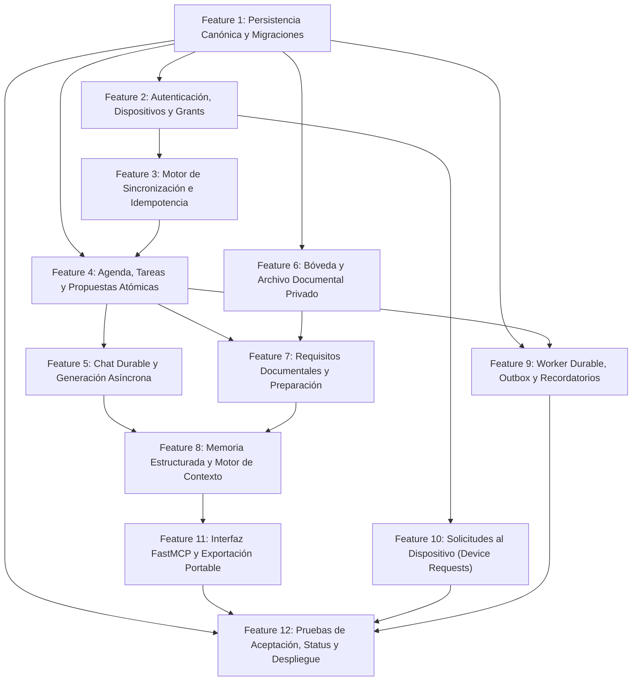

# Plan de Implementación por Features: Backend AgentAgenda

> **Documento de especificación de desarrollo modular para el backend de AgentAgenda.**
> Basado rigurosamente en la arquitectura canónica definida en [README.md](../README.md) y en la investigación de [LIFELONG_CHAT_RESEARCH.md](LIFELONG_CHAT_RESEARCH.md).

---

## 1. Visión y Estado del Backend

AgentAgenda es un asistente personal de organización y seguimiento con memoria estructurada y archivo documental privado. El backend (FastAPI) actúa como la autoridad canónica de datos, sincronización, memoria, documentos y orquestación de inferencia local.

### Comparativa: Estado Actual vs. Estado Objetivo

| Componente | Estado Actual (Prototipo) | Estado Objetivo (Backend Listo) |
| :--- | :--- | :--- |
| **Persistencia** | SQLite local directo (`agent_agenda.db`) con 3 tablas simples | PostgreSQL canónico con SQLAlchemy 2.0 (asyncpg), soporte de migraciones Alembic y locking por usuario. |
| **Sincronización** | Inexistente (endpoints REST aislados) | Protocolo bidireccional `sync_schema_version=1` (push de operaciones, pull por cursor `commit_seq`, bootstrap, tombstones e idempotencia). |
| **Identidad y Dispositivos** | Sin autenticación ni control de dispositivos | Emparejamiento seguro de un solo uso (`/auth/pair`), tokens revocables, registro de dispositivos y alcances de acceso (`access_grants`). |
| **Agenda y Propuestas** | Inserciones directas sin atomicidad; `LIKE "YYYY-MM-DD%"` | Control de zonas IANA (`America/Mexico_City`) + UTC; confirmación atómica transaccional de propuestas y agenda. |
| **Chat e Inferencia** | SSE efímero, cliente envía todo el historial, pérdida si se desconecta | Historial durable (`chat_turns`, `messages`), generación en segundo plano con estados (`queued`, `running`, `completed`), streaming SSE desacoplado. |
| **Archivo Documental** | Inexistente | Bóveda privada en disco, transferencias en chunks con SHA-256 verificado, metadatos, revisiones, control de accesos y descarga autenticada. |
| **Preparación de Citas** | Inexistente | Requisitos documentales vinculados a eventos (`document_requirements`), checklist trazable (`candidate`, `verified`, `missing`, `expired`). |
| **Memoria Estructurada** | Inexistente | Memorias episódicas, semánticas, procedimentales y prospectivas con vigencia temporal, fuentes de evidencia, corrección y presupuesto de tokens. |
| **Worker en Segundo Plano** | Inexistente | Outbox transaccional (`jobs`), procesamiento de recordatorios, OCR/extracción de texto asíncrona y limpieza de temporales. |
| **Integración Externa / MCP** | Inexistente | Servidor FastMCP con herramientas de solo lectura con alcance explícito para clientes como Codex o ChatGPT. |

---

## 2. Mapa de Ruta de Features

El desarrollo se organizará en **12 features modulares e incrementales**. Cada feature implementa su dominio, migraciones, endpoints y pruebas asociadas sin romper el funcionamiento de las fases previas.

---

## 3. Detalle de Features

### Feature 1: Arquitectura Base, Persistencia Canónica y Migraciones
* **Propósito**: Establecer la base de datos canónica con PostgreSQL (manteniendo compatibilidad de pruebas con SQLite/asyncpg), motor ORM asíncrono con SQLAlchemy 2.0 y control de migraciones con Alembic.
* **Archivos a crear/modificar**:
  - `services/backend/requirements.txt`: Añadir `sqlalchemy[asyncio]`, `asyncpg`, `alembic`, `psycopg2-binary` (opcional/herramientas), `greenlet`.
  - `services/backend/app/config.py`: Variables para PostgreSQL (`DATABASE_URL`), pool de conexiones, directorio de volumen privado de documentos.
  - `services/backend/app/db/session.py`: Fábrica de sesiones async (`async_sessionmaker`), engine con transacciones seguras.
  - `services/backend/alembic/` y `services/backend/alembic.ini`: Configuración de migraciones automáticas.
  - `services/backend/app/models/canonical.py`: Declaración de modelos SQLAlchemy para todas las tablas:
    - `sync_head`
    - `devices`, `auth_tokens`, `access_grants`
    - `events`, `tasks`, `reminders`, `proposals`
    - `chat_turns`, `messages`
    - `documents`, `document_revisions`, `document_files`
    - `document_requirements`, `document_links`
    - `entities`, `memories`, `memory_sources`
    - `operation_receipts`, `change_batches`
    - `device_requests`, `device_observations`
    - `jobs`, `audit_events`
  - `deploy/docker-compose.yml`: Añadir servicio `db` (PostgreSQL 16) con volumen persistente y variables de entorno conectadas.
* **Criterio de Aceptación**:
  - Migraciones de Alembic se aplican exitosamente en PostgreSQL y SQLite en memoria para tests.
  - Sesiones asíncronas con transacciones ACID y rollback automático ante excepciones.

---

### Feature 2: Autenticación, Dispositivos y Control de Acceso (Auth & Grants)
* **Propósito**: Permitir el emparejamiento seguro del cliente móvil (o agentes externos) mediante códigos de un solo uso, emisión de tokens con rotación/revocación y validación de permisos granulares (`scopes`).
* **Endpoints**:
  - `POST /v1/auth/pair`: Emparejamiento inicial mediante desafío/código con caducidad. Devuelve `device_id` y token de sesión.
  - `POST /v1/auth/refresh`: Renovación de credenciales revocables.
  - `POST /v1/auth/revoke`: Revocación explícita de un dispositivo o credencial.
* **Componentes**:
  - `services/backend/app/core/security.py`: Generación y verificación de tokens seguros (secrets, HMAC/JWT).
  - `services/backend/app/api/deps.py`: Dependencias FastAPI `get_current_device`, `require_scope("agenda:read")`, `require_scope("memory:read")`.
  - `services/backend/app/services/auth_service.py`: Lógica de emparejamiento, registro de dispositivo en base de datos y control de accesos.
* **Criterio de Aceptación**:
  - Un token revocado es rechazado de inmediato.
  - Rutas protegidas exigen credenciales válidas y devuelven 401/403 ante faltas de autorización.

---

### Feature 3: Motor de Sincronización Canónica y Transacciones Idempotentes
* **Propósito**: Implementar el protocolo `sync_schema_version=1` para comunicación offline-first con el cliente Flutter.
* **Endpoints**:
  - `POST /v1/sync/bootstrap`: Snapshot materializado consistente con watermark inicial (`commit_seq`).
  - `POST /v1/sync/push`: Lote de operaciones (`create`, `update`, `delete`, `set_status`) con `operation_id`, `operation_epoch` y `base_version`.
  - `GET /v1/sync/pull`: Obtención de cambios posteriores al cursor del cliente (`since_seq`).
  - `POST /v1/sync/ack`: Confirmación del cliente de que aplicó los cambios localmente.
  - `GET /v1/operations/{operation_id}`: Consulta del estado de una operación para recuperación tras timeout de red.
* **Componentes**:
  - `services/backend/app/services/sync_service.py`:
    - Bloqueo exclusivo de `sync_head` durante escrituras para garantizar orden monotónico estricto de `commit_seq`.
    - Deduplicación idempotente usando `operation_receipts` (mismo ID + mismo hash = respuesta cacheada; mismo ID + distinto hash = conflicto `409`).
    - Generación de `change_batches` con soporte de tombstones para borrados.
* **Criterio de Aceptación**:
  - Reintentar una operación no duplica registros ni incrementa versiones.
  - Dos escrituras concurrentes se ordenan estrictamente mediante `sync_head`.
  - Commits tardíos o eliminaciones respetan la ventana offline.

---

### Feature 4: Agenda, Tareas, Propuestas Atómicas y Zonas Horarias
* **Propósito**: Evolucionar la agenda actual para soportar tareas independientes, eventos con zonas IANA (`America/Mexico_City`), recurrencia, y confirmación atómica de propuestas con registro de auditoría.
* **Endpoints**:
  - `GET /v1/agenda/events`: Listar eventos por rango de fechas y zona horaria.
  - `POST /v1/agenda/events`: Crear/actualizar evento con validación de horas e IANA.
  - `DELETE /v1/agenda/events/{id}`: Marcado/eliminación con generación de tombstone.
  - `GET /v1/agenda/tasks`: Listado de tareas pendientes/completadas.
  - `POST /v1/agenda/tasks`: Crear/actualizar tarea.
  - `POST /v1/proposals`: Registro de propuestas generadas por el agente.
  - `GET /v1/proposals/pending`: Obtener última propuesta pendiente.
  - `POST /v1/proposals/{id}/confirm`: Confirmación atómica. Aplica eventos, tareas, actualiza la propuesta y añade al sync log en una **única transacción SQL**.
  - `POST /v1/proposals/{id}/reject`: Descartar propuesta.
* **Componentes**:
  - `services/backend/app/services/agenda_service.py`: Reglas de negocio de calendario, solapamientos y cálculo de fechas.
  - `services/backend/app/services/proposal_service.py`: Validación y aplicación transaccional de propuestas.
* **Criterio de Aceptación**:
  - Si la aplicación de una propuesta falla a mitad (por ejemplo, conflicto de versiones en un evento), toda la transacción se revierte; no quedan eventos parciales.
  - Consultas en diferentes fechas respetan la zona IANA y no alteran el `now`.

---

### Feature 5: Chat Durable, Generación Asíncrona y Streaming SSE
* **Propósito**: Desacoplar el streaming del chat de la persistencia de mensajes; permitir que el móvil consulte estados de generación (`queued`, `running`, `completed`, `failed`) sin perder historial ante cortes de red.
* **Endpoints**:
  - `POST /v1/chat/turns`: Envía un mensaje de usuario; genera y persiste el turno inmediatamente con `status: queued`.
  - `GET /v1/chat/turns/{turn_id}`: Consulta el estado y resultado del turno.
  - `GET /v1/chat/turns/{turn_id}/stream`: Suscripción SSE para recibir tokens en tiempo real; si la conexión se cierra, el backend finaliza la persistencia.
  - `POST /v1/chat/stream`: Endpoint de compatibilidad hacia atrás con la app Flutter existente.
  - `GET /v1/chat/messages`: Historial paginado mediante cursores.
* **Componentes**:
  - `services/backend/app/services/chat_orchestrator.py`: Orquestador de turnos. Construye contexto, invoca el LLM local, extrae propuestas estructuradas y persiste el resultado final antes de marcar `completed`.
  - `services/backend/app/services/prompt_builder.py`: Adaptador de contexto (instrucciones, actividades del día, memorias relevantes y últimos turnos).
* **Criterio de Aceptación**:
  - Desconectar el cliente SSE durante la generación no produce un estado corrupto; el mensaje del asistente queda guardado íntegro en base de datos.
  - Un reenvío con el mismo `client_message_id` devuelve el turno ya existente.

---

### Feature 6: Bóveda y Archivo Documental Privado (Document Vault)
* **Propósito**: Almacenar y catalogar de forma segura archivos originales (PDFs, imágenes) en un volumen privado fuera de Git, con verificación de integridad criptográfica y entrega autenticada.
* **Endpoints**:
  - `POST /v1/documents/uploads`: Inicia sesión de carga con metadatos (nombre, tipo MIME, tamaño esperado). Devuelve `upload_id`.
  - `PUT /v1/documents/uploads/{upload_id}/content`: Carga binaria en streaming con soporte para chunks.
  - `POST /v1/documents/uploads/{upload_id}/complete`: Verificación de tamaño y cálculo de SHA-256; publica la revisión oficial en PostgreSQL.
  - `GET /v1/documents/uploads/{upload_id}`: Progreso y estado de subida.
  - `GET /v1/documents`: Listado y búsqueda en catálogo (por título, alias, fechas, emisor).
  - `GET /v1/documents/{id}`: Ficha de metadatos y revisiones históricas.
  - `GET /v1/documents/{id}/versions/{version}/download`: Descarga autenticada del archivo binario original (streaming directo).
* **Componentes**:
  - `services/backend/app/services/document_storage.py`: Gestión del sistema de archivos privado (`storage/documents/`), hashes SHA-256, limpieza de subidas huérfanas.
  - `services/backend/app/services/document_catalog.py`: Creación y actualización de fichas documentales y revisiones.
* **Criterio de Aceptación**:
  - El archivo se guarda con su hash SHA-256 exacto; ante discrepancia en subida, se aborta y se limpia el temporal.
  - Las descargas verifican la identidad del usuario y permisos vigentes; no hay URLs públicas ni rutas expuestas del disco.

---

### Feature 7: Requisitos Documentales y Preparación de Compromisos
* **Propósito**: Conectar los documentos del archivo privado con los eventos y tareas de la agenda mediante listas de requisitos verificables.
* **Endpoints**:
  - `GET /v1/events/{id}/preparation`: Devuelve la preparación completa de una cita:
    - Lista de requisitos (`document_requirements`).
    - Documentos vinculados (`candidate`, `verified`).
    - Documentos faltantes (`missing`).
    - Documentos vencidos o que requieren revisión (`expired`, `needs_review`).
  - `POST /v1/events/{id}/requirements`: Añadir un requisito documental a un evento.
  - `POST /v1/events/{id}/requirements/{req_id}/link`: Vincular un documento específico a un requisito.
  - `POST /v1/events/{id}/requirements/{req_id}/verify`: Confirmar validez del documento para este compromiso.
* **Componentes**:
  - `services/backend/app/services/preparation_service.py`: Lógica de evaluación de requisitos, cálculo de vigencias y estado de completitud.
* **Criterio de Aceptación**:
  - La preparación de una cita distingue con precisión entre tener el documento en el servidor, tenerlo descargado y tenerlo físicamente preparado.
  - Eliminar o cancelar un evento no elimina los documentos asociados a él en el archivo privado.

---

### Feature 8: Memoria Estructurada Multimodal y Motor de Contexto
* **Propósito**: Proveer memoria continua a largo plazo al agente (episódica, semántica, procedimental y prospectiva) con vigencia temporal, atribución a fuentes originales y presupuesto estricto de tokens.
* **Endpoints**:
  - `POST /v1/memory/search`: Búsqueda de memorias por palabras clave, fechas, entidades y tipo.
  - `GET /v1/memory/{id}`: Detalle de una afirmación o recuerdo con sus enlaces a la fuente original (`memory_sources`).
  - `GET /v1/context`: Ensambla el bloque de contexto optimizado (`token_budget`, fecha `as_of`, propósito), consolidando hechos vigentes y descartando los obsoletos o revocados.
  - `POST /v1/memory/correct`: Corrección explícita de un hecho ("esto cambió", "esto era incorrecto"), creando una nueva versión y marcando la anterior como `superseded`.
  - `POST /v1/memory/forget`: Olvido y revocación de hechos o episodios, propagando la exclusión a futuros ensamblados de contexto.
* **Componentes**:
  - `services/backend/app/services/memory_service.py`: Almacenamiento, linaje de afirmaciones y versionado de hechos.
  - `services/backend/app/services/context_engine.py`: Algoritmo de empaquetado de contexto bajo límite estricto de tokens con filtrado por vigencia.
* **Criterio de Aceptación**:
  - Un recuerdo revocado o corregido no vuelve a aparecer en el contexto del modelo.
  - Las intenciones o propuestas provisionales no se almacenan como vivencias confirmadas.

---

### Feature 9: Worker Durable, Outbox de Recordatorios y Trabajos en Fondo
* **Propósito**: Ejecutar tareas asíncronas fiables sin bloquear el servidor web ni requerir inferencia continua del LLM.
* **Componentes**:
  - Tabla `jobs`: Cola durable compartida con estados (`pending`, `processing`, `completed`, `failed`, `cancelled`), reintentos y backoff.
  - `services/backend/app/worker/worker.py`: Bucle de ejecución asíncrono que procesa jobs de la base de datos:
    - **Recordatorios**: Cálculo de avisos previos a compromisos (ej. "1 hora antes") y generación de alertas persistidas.
    - **Extracción Documental**: Parser de texto local para PDFs e imágenes (modo simulado o local con PyPDF/Tesseract) actualizando `document_revisions.extracted_text`.
    - **Limpieza de Temporales**: Eliminación de subidas huérfanas inactivas.
* **Criterio de Aceptación**:
  - Los recordatorios funcionan y se despachan aunque el modelo LLM esté apagado o saturado.
  - Un fallo en un trabajo se reintenta hasta el límite configurado sin perder el estado del sistema.

---

### Feature 10: Solicitudes al Dispositivo y Contexto Móvil (Device Requests)
* **Propósito**: Permitir que el servidor solicite de forma asíncrona datos puntuales al teléfono (hora/zona verificada, ubicación puntual autorizada, snapshot acotado de calendario) sin bloquear llamadas activas.
* **Endpoints**:
  - `POST /v1/device-requests`: Servidor o agente crea una solicitud con `capability` (`location`, `calendar_snapshot`, `timezone`), propósito, caducidad (`ttl`) y antigüedad máxima aceptable.
  - `GET /v1/device-requests/pending`: El móvil consulta si tiene solicitudes pendientes de resolver.
  - `POST /v1/device-requests/{id}/response`: El móvil entrega la observación obtenida o el estado de error (`denied`, `unavailable`, `expired`).
* **Componentes**:
  - `services/backend/app/services/device_request_service.py`: Gestión del ciclo de vida de las solicitudes, validación de caducidad y guardado en `device_observations`.
* **Criterio de Aceptación**:
  - Una respuesta tardía que supera el `ttl` es rechazada y marcada como `expired`.
  - La denegación de permisos en el teléfono se registra limpiamente sin generar errores en la agenda.

---

### Feature 11: Interfaz FastMCP y Exportación Portable (Agentes Externos)
* **Propósito**: Exponer herramientas de lectura con ámbito estricto para clientes externos como Codex o ChatGPT mediante el Model Context Protocol (MCP), junto con generación de paquetes de contexto (`context_exports`).
* **Endpoints y Herramientas**:
  - Endpoint `/mcp` o servidor FastMCP integrado con herramientas:
    - `get_personal_context(purpose, as_of, token_budget)`
    - `search(query, filters, as_of, limit)`
    - `fetch(id, version)`
    - `query_agenda(from, to, timezone)`
    - `search_documents(query, event_id, filters)`
    - `get_event_preparation(event_id)`
    - `get_device_context(fields, max_age)`
    - `propose_memory_change(proposal)` (solo lectura/propuesta, sin auto-aceptación)
    - `propose_agenda_change(proposal)` (solo propuesta)
  - `POST /v1/context/exports`: Genera un archivo Markdown/JSON exportable con fecha de corte, fuentes y hash canónico.
* **Componentes**:
  - `services/backend/app/mcp/server.py`: Servidor FastMCP con validación de autenticación y scope por grant.
  - `services/backend/app/services/export_service.py`: Generador de exportaciones portables.
* **Criterio de Aceptación**:
  - Un agente externo conectado por MCP solo puede ver los datos cubiertos por su `grant`; no puede forzar escrituras automáticas ni descargar binarios sin el permiso explícito `documents:download`.

---

### Feature 12: Pruebas de Aceptación Automatizadas, Status y Despliegue
* **Propósito**: Verificar la integridad completa del sistema mediante pruebas unitarias y de integración que validen los 23 casos de aceptación de la sección 13 del README, y dejar listos los scripts de despliegue.
* **Componentes**:
  - `GET /v1/status`: Endpoint de estado del sistema (salud de base de datos, versión de esquema sync, worker activo, estado de conexión con el LLM).
  - `tests/`: Suite completa con `pytest` y `httpx.AsyncClient`:
    - `tests/test_auth.py`: Emparejamiento, renovación y permisos.
    - `tests/test_sync.py`: Push, pull, idempotencia y resolución de conflictos.
    - `tests/test_agenda_proposals.py`: Atomicidad transaccional de propuestas y agenda.
    - `tests/test_documents.py`: Carga en chunks, validación SHA-256 y descarga autenticada.
    - `tests/test_preparation.py`: Checklist y faltantes de citas.
    - `tests/test_memory.py`: Búsqueda, corrección, vigencia y presupuesto de contexto.
    - `tests/test_worker.py`: Despacho de jobs y recordatorios sin LLM.
    - `tests/test_mcp.py`: Control de acceso y herramientas de solo lectura.
  - `deploy/docker-compose.yml`: Archivo compose completo para levantar PostgreSQL, backend FastAPI y volumen de documentos.
  - `deploy/Dockerfile`: Dockerfile optimizado para producción.
* **Criterio de Aceptación**:
  - Todos los tests pasan exitosamente (`pytest -v`).
  - El contenedor levanta y responde a `GET /health` y `GET /v1/status` limpiamente.

---

## 4. Orden de Ejecución Sugerido

Para garantizar avances sólidos y verificables paso a paso:

1. **Sprint 1 (Fundación y Datos)**:
   - **Feature 1**: Persistencia Canónica y Migraciones.
   - **Feature 2**: Autenticación, Dispositivos y Grants.
2. **Sprint 2 (Sincronización y Agenda)**:
   - **Feature 3**: Motor de Sincronización e Idempotencia.
   - **Feature 4**: Agenda, Tareas y Propuestas Atómicas.
3. **Sprint 3 (Chat Durable y Archivo Documental)**:
   - **Feature 5**: Chat Durable y Generación Asíncrona.
   - **Feature 6**: Bóveda y Archivo Documental Privado.
4. **Sprint 4 (Compromisos, Memoria y Workers)**:
   - **Feature 7**: Requisitos Documentales y Preparación de Citas.
   - **Feature 8**: Memoria Estructurada y Motor de Contexto.
   - **Feature 9**: Worker Durable, Outbox y Recordatorios.
5. **Sprint 5 (Integraciones y Cierre)**:
   - **Feature 10**: Solicitudes al Dispositivo (Device Requests).
   - **Feature 11**: FastMCP y Exportaciones Portables.
   - **Feature 12**: Pruebas de Aceptación Completas y Despliegue.
