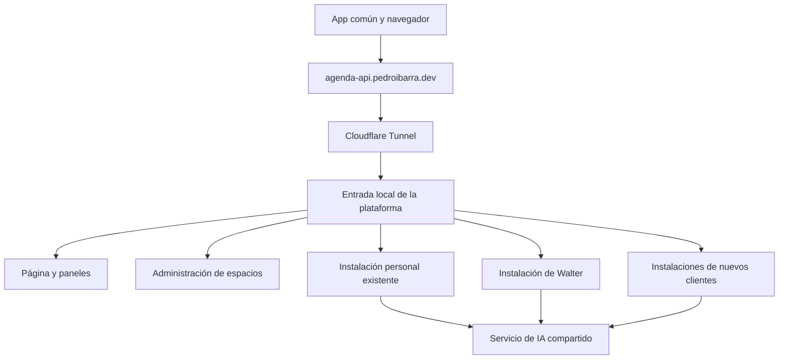

# Plan de transición de AgentAgenda a un servicio por espacios

Borrador para revisar con Pedro. Fecha: 8 de octubre de 2026.

AgentAgenda tendrá una app común y una página en `agenda-api.pedroibarra.dev`. Pedro podrá crear, suspender y cerrar espacios; cada cliente accederá a su agenda, conversaciones y documentos mediante una sesión propia. La instalación personal se incorporará conservando su base de datos y archivos. Walter seguirá como cliente y su subdominio dedicado se retirará al terminar la transición.

Este borrador define el trabajo futuro. Prepararlo no modifica aplicaciones, rutas de Cloudflare, credenciales ni datos del servidor.

## Decisiones acordadas

| Tema | Decisión |
| --- | --- |
| Dirección pública | Conservar `agenda-api.pedroibarra.dev` para página y API. |
| Walter | Mantener su espacio; retirar `walteragenda.pedroibarra.dev`. |
| App | Un APK común, con activación por código, enlace o QR. |
| Rama del producto | Unificar el código entregable en `main`, sin ramas permanentes por cliente. |
| Paquete Android | Un paquete general `com.agentagenda.agent_agenda`, con nombre AgentAgenda y una firma de distribución común. |
| Reinstalación personal | Instalar el APK general y reconectar mediante un código temporal al espacio personal existente. |
| Administración | Pedro será el único administrador del servicio. |
| Datos administrativos | Nombre del cliente, estado, recursos, límites y consumo técnico. |
| Contenidos | Sólo en las interfaces del propietario; sin visor de contenido ni acceso como cliente en el panel administrativo. |
| IA y OCR | Seguirán ejecutándose en el servidor de Pedro. |
| Aislamiento inicial | Base, archivos, backend y worker dedicados por espacio; imagen de aplicación e IA compartidas. |
| Cifrado | Proteger almacenamiento, respaldos y transmisión; el servicio podrá descifrar para procesar IA y OCR. |

El aislamiento dedicado permite avanzar sin mezclar las bases existentes. La identidad del administrador será distinta de su sesión como propietario de la agenda personal, aunque ambas correspondan a Pedro.

## Estado actual y datos que deben conservarse

Las dos instalaciones están funcionando internamente en `cite-server`. Sus bases y almacenamiento utilizan volúmenes diferentes.

| Instalación | Backend | Base | Volumen de base | Volumen de archivos |
| --- | --- | --- | --- | --- |
| Personal | `agent-backend`, puerto local 8001 | `agent-db` | `deploy_pg_data` | `deploy_document_storage` |
| Walter | `walter-backend`, puerto local 8101 | `walter-db` | `deploy-walter_walter_pg_data` | `deploy-walter_walter_document_storage` |

El inventario del 8 de octubre encontró estos conteos totales de tablas. Incluyen registros históricos y, donde aplica, borrados lógicos; no equivalen necesariamente a elementos visibles en la app.

| Tabla | Personal | Walter |
| --- | ---: | ---: |
| Eventos | 715 | 7 |
| Documentos | 97 | 0 |
| Revisiones documentales | 127 | 0 |
| Mensajes | 50 | 0 |
| Dispositivos | 2 | 0 |
| Tokens, incluidos registros históricos | 59 | 0 |

En ambas instalaciones el estado consultado indicaba PostgreSQL conectado, almacenamiento disponible, worker activo, cero trabajos pendientes e IA online. Los conteos se tomarán nuevamente antes del corte, porque el servicio puede seguir recibiendo cambios.

La ausencia de dispositivos en Walter y la falta de una pantalla de activación en el móvil explican probablemente la instalación que no pudo usar. La nueva app resolverá la primera sesión. Los siete eventos deben identificarse antes de tratarlos como datos de ejemplo.

## Entrada común y compatibilidad

El túnel apuntará a un servicio de entrada local en vez de directamente al backend personal. Ese servicio distribuirá solicitudes hacia recursos registrados. Cloudflare conservará una única entrada pública; las altas y bajas modificarán el registro interno, sin crear DNS ni túneles por cliente.

| Ruta propuesta | Destino |
| --- | --- |
| `/` | Página de acceso, descarga de app y activación. |
| `/admin` | Panel del administrador. |
| `/control/v1/...` | Operaciones administrativas con autorización independiente. |
| `/activar` | Primera activación del propietario. |
| `/app` | Dashboard del propietario autenticado. |
| `/s/<space_id>/v1/...` | API del espacio indicado, con sesión válida para ese espacio. |
| `/s/<space_id>/health` | Salud del backend seleccionado para la comprobación de la app. |
| `/v1/...` | Compatibilidad temporal con la instalación personal actual. |
| `/health` | Salud básica de la entrada común. |

El identificador del espacio será estable y no dependerá del nombre del cliente. El nombre podrá cambiar sin alterar rutas ni credenciales. La ruta no autoriza: cada backend verificará sus tokens y la entrada bloqueará espacios suspendidos o cerrados. Ningún cliente podrá indicar una dirección interna arbitraria como destino.

Una ruta de espacio desconocida devolverá rechazo y nunca caerá por defecto en la instalación personal. La ruta antigua `/v1/...` tendrá una asignación explícita al espacio personal y compartirá sus comprobaciones de estado y suspensión.

Para las instalaciones actuales, el proxy retirará `/s/<space_id>` al reenviar la petición. Mantendrá el flujo SSE del chat, las cargas y descargas de documentos, las cabeceras necesarias y las comprobaciones de origen de MCP. Servirá las respuestas directamente, sin redirigir archivos a los subdominios anteriores. Cloudflare reenvía la ruta completa; el ajuste del prefijo debe realizarlo el proxy o la aplicación. [Documentación de Cloudflare](https://developers.cloudflare.com/tunnel/features/locally-managed-tunnels/configuration-file/).

Los enlaces documentales que devuelve el backend usan rutas como `/v1/documents/...`. La app y la web los resolverán respecto al espacio activo, conservando su prefijo. Un enlace de Walter no puede terminar en la ruta de compatibilidad personal `/v1/...`; la prueba de descarga desde una referencia del chat cubrirá este caso.

## Incorporación de la agenda personal

La primera transición cambiará el acceso y el registro de la instalación. No requiere importar eventos o documentos en otra base.

1. Crear el espacio personal en el registro central y asociarlo al backend, base y volumen existentes.
2. Conservar los propietarios actuales, incluido `default_user` donde se use, dentro de esa base dedicada.
3. Conservar IDs, versiones, dispositivos, tokens, permisos documentales, historial, secuencias de sincronización y recibos de operaciones.
4. Mantener `/v1/...` conectado a la misma instalación durante la convivencia con el cliente actual.
5. Validar el nuevo acceso y preparar un código de reconexión al espacio personal existente.
6. Reinstalar el APK general, consumir el código y comprobar que la nueva sesión recupera el contenido del mismo espacio.

La reinstalación cambia la aplicación y su sesión en el teléfono. El contenido sincronizado sigue en la base y los archivos del servidor; no se crea otra cuenta, no se ejecuta una semilla y no se restaura un dump para volver a mostrarlo. La app consulta el mismo espacio después de obtener sus nuevas credenciales.

Antes de desinstalar se verificará el respaldo y se revisarán cambios o archivos que sólo existan en el teléfono. La sesión del dispositivo reemplazado se revocará después de validar la nueva, conservando otros dispositivos y clientes autorizados. Los permisos de Android, los ajustes locales y los avisos se configurarán nuevamente; los datos locales que deban conservarse se exportarán o sincronizarán antes.

El código personal se generará y entregará durante el corte, cuando el flujo de reconexión esté probado. Quedará ligado en servidor al espacio y al propietario existentes, será temporal y de un uso, y no se incorporará al plan, al APK ni a Git.

La migración de almacenamiento para activar cifrado puede requerir una copia física de base y archivos en otra fase. Esa copia debe conservar los mismos datos y referencias; no implica fusionar cuentas.

## Unificación de rama y paquete

`main` concentrará el código de backend, página y app común. Se integrarán los cambios útiles de las ramas actuales, se resolverán los cambios coincidentes y se retirará la personalización fija de Walter. El nombre del cliente y su conexión serán datos del espacio, no decisiones de compilación. Las ramas antiguas dejarán de usarse para entregas una vez conservado e integrado su historial.

El paquete general será `com.agentagenda.agent_agenda`, que ya aparece como identidad general del proyecto antes de la variante de Walter. Todos los clientes recibirán el mismo APK y utilizarán la misma firma de distribución, guardada fuera de Git y respaldada. Las futuras actualizaciones conservarán paquete y firma.

Se acepta una instalación limpia para el cambio inicial del cliente personal. No se requiere que la firma nueva sea compatible con la instalación antigua; sí se verificarán paquete y firma del APK general para su distribución y las actualizaciones posteriores. No habrá compilaciones especiales con credenciales de Pedro o Walter.

## Página y paneles

La página se hospedará en el mismo servidor, detrás del túnel. El primer alcance será el acceso al producto, el panel administrativo y el dashboard privado. La facturación automática y una página comercial extensa quedan para una etapa posterior.

| Pantalla | Funciones |
| --- | --- |
| Inicio | Descargar APK, activar espacio y entrar al dashboard. |
| Acceso administrativo | Iniciar sesión con la identidad del único administrador. |
| Lista de espacios | Nombre, propietario, estado, salud y consumo; botón Crear espacio. |
| Crear espacio | Nombre del cliente, límites y progreso de preparación. |
| Detalle administrativo | Estado, operaciones, activación inicial, suspender, reactivar y cerrar. |
| Dashboard privado | Agenda, chat con streaming, documentos y preferencias del propietario. |
| Dispositivos | Ver y revocar sesiones propias, y autorizar nuevos dispositivos. |

El panel administrativo no tendrá listados de documentos, títulos de eventos, conversaciones ni botón para entrar como usuario. Los errores técnicos y la auditoría tampoco incluirán esos contenidos. La identidad administrativa no servirá como credencial de lectura de una agenda.

La autenticación administrativa tendrá un verificador y credenciales independientes de las sesiones de contenido. Los scopes actuales `admin` o `*` de la API de contenido no serán permisos del panel central. Se probará el rechazo de una sesión administrativa en las API personales y el rechazo de una sesión de cliente en `/control/v1/...`.

El dashboard privado utilizará los permisos de contenido ya existentes, con su sesión propia. Compartir origen web requiere separar sesiones administrativas y personales, y separar caché y estado entre espacios.

## Alta de clientes y activación de la app

El botón Crear espacio iniciará una operación en segundo plano. Preparará recursos desde una imagen común y un esquema vacío, con credenciales propias, sin copiar datos personales ni activar la semilla de actividades de demostración.

El registro central almacenará espacios, propietarios, asignación de recursos, estados, invitaciones, operaciones y auditoría. Las invitaciones se guardarán como hashes, con vencimiento y consumo de un uso. Los secretos operativos tendrán custodia independiente y no aparecerán en el panel ni en Git.

Crear una operación dos veces no debe duplicar recursos. Una preparación fallida debe mostrar su estado y permitir un reintento seguro, conservando la identificación de los recursos ya creados.

La app común abrirá una bienvenida cuando no tenga espacio activo. El cliente introducirá el código o utilizará el enlace o QR. El registro central reservará la invitación para una única reclamación y coordinará la creación de la sesión del dispositivo en el backend asignado. La app comprobará identidad mediante `/v1/auth/me` y lectura autorizada antes de mostrar la agenda; una respuesta satisfactoria de `/health` no bastará.

La activación utilizará una operación idempotente ligada al espacio y al dispositivo. Como el registro central y la base personal son distintos, se definirá la reconciliación y el reintento si falla la emisión de credenciales o se pierde la respuesta. Una operación incompleta no deberá dejar al cliente sin acceso ni crear propietarios o dispositivos duplicados. La invitación se marcará completada sólo cuando su resultado sea recuperable de forma segura.

El código inicial será temporal, no una contraseña permanente. Los accesos posteriores utilizarán credenciales revocables por dispositivo. Autorizar otro dispositivo o recuperar acceso a un espacio ya activado tendrá un flujo propio del propietario; regenerar una invitación inicial no debe permitir suplantarlo.

La reconexión después de reinstalar será una operación distinta del alta inicial. Se emitirá a solicitud del propietario, tras verificar su identidad por el mecanismo acordado. Su código vinculará el espacio, propietario y asignación de datos existentes, y sólo permitirá crear una sesión de dispositivo. La app no podrá modificar esa asignación ni convertir una reconexión en creación de un espacio vacío. Para Pedro se preparará esta operación al incorporar su agenda actual.

Cada espacio tendrá una asignación interna hacia su instancia y su propietario de datos. Al consumir la invitación, el servicio de activación emitirá credenciales que esa instancia reconozca, utilizando el mecanismo de tokens del backend. Una sesión administrativa o un token del registro central no se reenviará como credencial de contenido. Las credenciales personales existentes seguirán siendo válidas durante la convivencia.

La primera activación se resolverá mediante un canal interno de provisión con permisos acotados, porque el endpoint actual de desafío exige una sesión previa. Se retirará del servicio público el atajo que acepta `SECRET_KEY` como código para `default_user`. El APK no incluirá credenciales de aplicación ni de clientes.

La app guardará credenciales en almacenamiento seguro del dispositivo. El estado local se asociará al espacio: tokens, filtros, archivos temporales, caché y avisos. Cambiar de espacio cancelará operaciones y avisos anteriores, y nunca enviará las credenciales anteriores al nuevo destino.

Los permisos de contexto documental que estén ligados al dispositivo anterior se revisarán en la reconexión. El propietario podrá trasladar al nuevo dispositivo los accesos vigentes que corresponda, conservando documentos, revisiones y límites autorizados. No se convertirán en permisos globales ni se ampliarán automáticamente a revisiones futuras o a otros clientes.

## Privacidad y cifrado del servicio

El modelo acordado mantiene IA y OCR en el servidor. Los contenidos estarán separados entre clientes y ausentes del panel administrativo. El servicio conserva capacidad de descifrar lo que procesa; no se ofrecerá como cifrado de extremo a extremo que impida el acceso técnico del dueño de la infraestructura.

La primera versión debe incluir almacenamiento cifrado y respaldos cifrados de manera independiente. La inspección de bloques mostró sistemas ext4 sin mapeos de bloque `crypt` visibles; se verificará si hay otras capas de cifrado antes de elegir el procedimiento. No se asumirá que los volúmenes Docker ya están cifrados.

Para los recursos actuales, primero se comprobará un respaldo recuperable y después se preparará el traslado al almacenamiento cifrado, con un corte controlado de escrituras y verificación de integridad. No se reformatearán los discos usados por otras aplicaciones. Nuevos espacios utilizarán el almacenamiento protegido desde su creación.

Una copia hecha desde un volumen montado puede producir archivos legibles; los dumps, exportaciones y respaldos necesitan su propio cifrado. Las claves no viajarán en el mismo paquete que el respaldo. Las copias históricas y temporales se revisarán dentro de una política de retención acordada. [Opciones de cifrado de PostgreSQL](https://www.postgresql.org/docs/16/encryption-options.html).

El cifrado adicional de campos y archivos desde la aplicación podrá evaluarse después. Afecta búsquedas, índices y extracción documental, por lo que no se añadirá sin adaptar esos recorridos. Se utilizarán bibliotecas y formatos existentes.

## Transición de Walter y cierre de espacios

Se propone registrar la instalación de Walter como su espacio y completar su activación en la app común. Así se conserva la separación física existente y se cambia únicamente la entrada pública. Si sus siete eventos resultan ser ejemplos de la semilla, se podrán retirar selectivamente tras el respaldo y la comprobación de sus IDs.

Cuando Walter pueda entrar por la dirección común, se retirarán el hostname anterior, su registro DNS y la publicación correspondiente. El contenedor `walter-tunnel` se detendrá sólo tras verificar que es exclusivo de ese hostname. Su backend, base y archivos seguirán disponibles por la entrada común. No se eliminarán volúmenes como parte del cambio de URL.

El producto tendrá acciones distintas:

- **Suspender:** bloquear nuevas solicitudes y trabajos, detener o cancelar trabajo activo de forma controlada y conservar datos.
- **Reactivar:** volver a habilitar el mismo espacio y sus datos.
- **Cerrar:** bloquear el espacio y preparar su retiro durante una ventana de recuperación acordada.
- **Eliminar:** purgar recursos y respaldos conforme a esa retención; es una operación posterior al cierre.

La suspensión bloqueará también las rutas antiguas que pudieran alcanzar ese espacio. No podrá retirar archivos o contenidos que el cliente ya haya descargado a su teléfono.

## Etapas de implementación

| Etapa | Entrega | Condición para avanzar |
| --- | --- | --- |
| 1 Preparación | Inventario actualizado, respaldo cifrado, restauración de prueba y contratos de rutas e identidades. | Se puede recuperar la instalación personal y la de Walter. |
| 2 Construcción local | Código integrado en `main`, entrada común, registro central, página y panel; plantilla de espacios vacíos. | Crear y suspender un espacio sintético funciona sin tocar producción. |
| 3 App y web privadas | APK general, activación y reconexión reales, sesiones de dispositivo, dashboard privado y separación de estado local. | Dos clientes sintéticos no pueden acceder a los datos del otro; reinstalar y reconectar conserva el espacio. |
| 4 Protección del almacenamiento | Recursos protegidos para altas y traslado controlado de recursos existentes. | Respaldos restaurables e integridad comprobada después del traslado. |
| 5 Incorporación personal | Registro del espacio existente, nueva entrada de Cloudflare y reinstalación del APK general mediante código personal. | La app general recupera los mismos datos; agenda, documentos, chat y MCP siguen funcionando. |
| 6 Walter y retiro del hostname | Activación de Walter por la app común y retiro de su entrada dedicada. | Walter puede usar su espacio por `agenda-api.pedroibarra.dev`. |
| 7 Operación | Recuperación de accesos, cuotas, cierre, respaldos y diagnóstico del servicio. | Altas y bajas no requieren editar DNS ni abrir contenido en administración. |

Las etapas se implementarán y probarán por separado. La aprobación del plan iniciará la implementación; no sustituye las verificaciones que deben preceder cada corte.

## Pruebas y vuelta atrás

Se probarán activación caducada o reutilizada, sesiones de otro espacio, revocación, suspensión, reactivación y fallos parciales de aprovisionamiento. Se comprobarán agenda, chat SSE, documentos originales, carga, búsqueda, permisos, sincronización y MCP cuando esté configurado. Los recorridos de contenido se validarán con datos sintéticos antes de usar los espacios reales.

La prueba de recuperación empezará con una instalación limpia del APK general. El código personal debe abrir el espacio existente con los mismos IDs, versiones, documentos, historial y secuencias; sólo se añadirán los registros de la nueva sesión y dispositivo. Se probarán reinicio, renovación de sesión, código vencido o reutilizado y revocación del dispositivo reemplazado sin afectar al nuevo. También se verificará el acceso de contexto a las revisiones documentales autorizadas para la reconexión.

Para la instalación personal se compararán conteos, IDs, versiones y hashes documentales con el inventario del corte, contemplando escrituras autorizadas posteriores. Los manifiestos privados y respaldos se guardarán fuera de Git; la documentación operativa sólo incluirá resultados y metadatos necesarios.

Una falla de aislamiento, pérdida de datos, renovación de sesión, descarga o duplicación de operaciones detendrá el avance. Antes de activar otros clientes en la entrada común, se puede volver a apuntar el túnel al backend personal original. Después de activar Walter u otros clientes, se restaurará una versión verificada de la entrada común y de sus rutas para conservar también esos accesos. Las instancias conservadas seguirán siendo la fuente de datos.

El retorno directo al backend personal sólo se utilizará antes de habilitar el ciclo de suspensión en producción, o conservando un bloqueo equivalente. Ninguna vuelta atrás podrá volver accesible un espacio que el administrador haya suspendido.

Después de trasladar almacenamiento, se definirá el retorno hacia el volumen verificado que contenga las escrituras más recientes. No se restaurará un dump antiguo sobre cambios nuevos ni se habilitarán dos copias de la agenda para recibir escrituras simultáneas.

Los hostnames anteriores se conservarán durante las verificaciones de convivencia que acordemos. Su retiro se hará después de la prueba desde los teléfonos y del registro del resultado del corte.

## Puntos para afinar antes de implementar

1. Confirmar si el primer dashboard privado incluye agenda, chat y documentos completos, como propone este borrador, o si empezamos con activación y administración de dispositivos.
2. Elegir los límites iniciales de archivos, almacenamiento e IA por cliente, sin fijar un precio antes de medir consumo y capacidad.
3. Definir la ventana de recuperación de espacios cerrados, la retención de respaldos y el momento de retiro de rutas antiguas.
4. Confirmar el mecanismo de acceso administrativo y verificación de identidad para emitir códigos de reconexión, y la custodia de la firma única del APK general.

## Referencias del proyecto

- [Despliegue original](operations/2026-09-15-inference-deployment.md).
- [Configuración de despliegue](../deploy/docker-compose.yml).
- [Cliente HTTP y credenciales móviles](../apps/mobile/lib/core/network/api_client.dart).
- [Estado local de avisos](../apps/mobile/lib/core/notifications/follow_up_service.dart).
- [Autenticación y dispositivos](../services/backend/app/services/auth_service.py).
- [Desafíos y atajo de configuración que debe retirarse del alta SaaS](../services/backend/app/core/security.py).
- [Semilla inicial que debe desactivarse para espacios nuevos](../services/backend/app/db/seed.py).
- [Modelos canónicos y propietarios](../services/backend/app/models/canonical.py).
